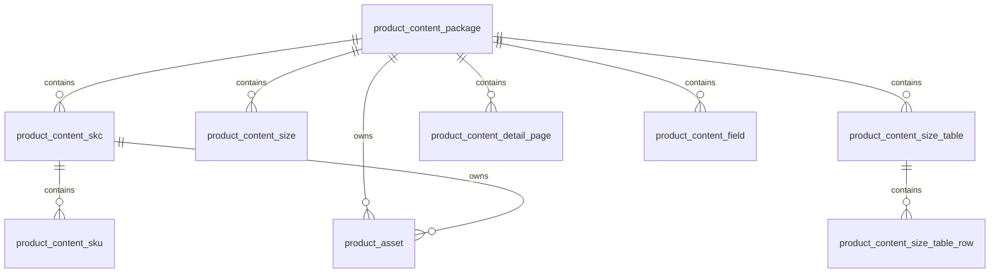

# 深绘内容包结构化建模

更新时间：2026-04-29

本文记录深绘商品内容包 `body` 的本地结构化落库模型。目标是保留深绘原始内容包，同时把高频使用的基础信息、SPU-SKC-SKU 层级、颜色、尺码、尺码表、图片、详情页和关键字段拆到可查询表，供后续生成平台 listing 草稿、图片转换和发布前校验使用。

## 入口命令

先同步深绘内容包：

```bash
npm run deepdraw:sync -- --tenant 电商巴拉巴拉 208226102001 208226103201
```

再导入本地 SQLite：

```bash
npm run deepdraw:import
```

可指定同步产物和数据库：

```bash
npm run deepdraw:import -- --source data/deepdraw-content/20260429T054418Z --db data/app.sqlite
```

导入脚本会自动执行数据库迁移。默认数据库为 `data/app.sqlite`。

## 原始数据保存

深绘响应顶层结构是：

```text
code / response / reason / requestId / timestamp / body
```

本地保存策略：

| 表 | 字段 | 内容 |
| --- | --- | --- |
| `product_content_package` | `raw_payload_json` | 原样保存深绘 `body` |
| `product_content_package` | `raw_response_json` | 保存包含 `code/response/reason/body` 的完整响应 |
| 子表 | `raw_payload_json` | 保存当前结构化行对应的深绘原始片段 |

也就是说，后续任何字段抽取规则如果需要重算，都可以从 `product_content_package.raw_payload_json` 重新派生。

## 层级关系

深绘内容包按 Listingfy 内部商品层级建模：



| 层级 | 表 | 主键/幂等键 | 来源 |
| --- | --- | --- | --- |
| SPU 内容包 | `product_content_package` | `source_system + source_code` | `body.code` |
| SKC 款色 | `product_content_skc` | `content_package_id + skc_code` | SKU 的 `唯品会货号`，兜底图片 `skc` |
| SKU 规格 | `product_content_sku` | `content_package_id + sku_code` | SKU `小红书商家编码`，兜底 `skc_code + size` |

`product_content_package` 不直接覆盖 MDM 的 `product_spu/product_skc/product_sku`。深绘是内容来源，MDM 仍是主数据来源；后续发品草稿可以按 `spu_code/skc_code/sku_code` 关联两边数据。

## 表说明

| 表 | 说明 |
| --- | --- |
| `product_content_package` | SPU 级内容包，保存标题、品牌、类目、价格、渠道、颜色/尺码 JSON、`body` raw payload |
| `product_content_skc` | SKC 级款色，保存 `skc_code`、颜色名、深绘颜色别名和该色 SKU 数 |
| `product_content_sku` | SKU 级规格，保存 SKU code、尺码、条码、商家编码、价格、库存数量、SKU values JSON |
| `product_content_size` | SPU 级可选尺码，保存尺码名、尺码 code、尺码别名和排序 |
| `product_content_size_table` | 尺码表头，保存深绘字段 ID/名称、options、行数和 raw payload |
| `product_content_size_table_row` | 尺码表行，按尺码保存胸围、袖长、肩宽等 `values_json` |
| `product_content_detail_page` | 详情页模板，保存模板名、宽度、HTML/图片/混合页面 URL、截图数、模块 JSON |
| `product_content_field` | 深绘字段池有效字段，保存 field id/name/type、文本值、选项值和 `is_key` 标记 |
| `product_asset` | 图片/详情页素材，保存深绘图片 URL、归属 SPU/SKC、渠道、图片类型、尺寸、排序、用途 |

## 图片建模

`product_asset` 目前接收三类深绘素材：

| `source_kind` | 来源 | 说明 |
| --- | --- | --- |
| `PICTURE` | `body.pictures.pictures[place].pictures[pictureType][]` | 商品主图、白底图、颜色图、资质图等 |
| `DETAIL_SCREENSHOT` | `body.detalPages[].screenShotSectionUrls[]` | 详情页截图切片 |
| `DETAIL_MODULE` | `body.detalPages[].modules[moduleName][]` | 按模块归类的详情页截图 |

深绘图片 URL 可能是 `//product.resources.deepdraw.biz/...`，导入时会写入：

- `source_url`：深绘原始 URL
- `normalized_url`：补全协议后的 URL，当前统一补 `http:`

同一张图片可能在多个渠道或类型下重复出现，所以 `product_asset` 保留用途行，不按 URL 强制去重。后续如果要建立物理图片库，可以再基于 `normalized_url` 做资产去重和用途关联。

## 关键 fields

`product_content_field` 会保存所有非空字段，并额外用 `is_key` 标记后续发品常用字段。当前关键字段匹配范围包括：

- 标题、品牌、货号、条码、商家编码
- 适用性别、适用年龄、适用季节、风格、图案、厚薄
- 材质、面料、成分、卖点、推荐理由
- 发货方式、限购、价格、市场价、商品重量
- 上市时间、产地、是否商场同款、安全和执行标准

字段值同时保留：

| 字段 | 说明 |
| --- | --- |
| `value_text` | `texts/options/value` 合并后的检索文本 |
| `texts_json` | 深绘 `texts` |
| `options_json` | 深绘 `options` |
| `option_aliases_json` | 深绘 `optionAliases` |
| `raw_payload_json` | 当前 field 原始片段 |

## 查询视图

迁移提供两个视图：

| 视图 | 用途 |
| --- | --- |
| `v_product_content_hierarchy` | 拉平查看 SPU-SKC-SKU 内容层级 |
| `v_product_content_asset_summary` | 按 SPU、素材类型、渠道、图片类型汇总素材数量 |

示例：

```sql
select spu_code, count(distinct skc_code) as skcs, count(sku_code) as skus
from v_product_content_hierarchy
group by spu_code;
```

```sql
select spu_code, source_kind, count(*) as rows, count(distinct normalized_url) as urls
from product_asset
group by spu_code, source_kind;
```

## 当前样例导入结果

基于 `data/deepdraw-content/20260429T054418Z` 导入结果：

| 表 | 行数 |
| --- | ---: |
| `product_content_package` | 2 |
| `product_content_skc` | 4 |
| `product_content_sku` | 24 |
| `product_content_size` | 12 |
| `product_content_size_table` | 8 |
| `product_content_size_table_row` | 36 |
| `product_content_detail_page` | 2 |
| `product_content_field` | 254 |
| `product_asset` | 432 |

按款号：

| 款号 | SKC | SKU | 深绘商品图片 | 详情页截图 | 详情页模块图 |
| --- | ---: | ---: | ---: | ---: | ---: |
| `208226102001` | 2 | 12 | 155 | 29 | 29 |
| `208226103201` | 2 | 12 | 161 | 29 | 29 |

导入脚本采用“内容包 upsert + 子表先删后插”的方式，重复导入同一批次不会产生重复子表行。

## 后续使用建议

1. 发品草稿以 MDM `product_spu/product_skc/product_sku` 为主数据，按 code 关联深绘 `product_content_*` 表补内容和素材。
2. SHEIN 图片使用前，从 `product_asset` 选择候选图，再调用 SHEIN `transform-pic`，把结果写入后续 `listing_asset` 或 `platform_identity`。
3. 尺码表优先使用 `product_content_size_table_row.values_json` 渲染或映射，不把详情页截图当成唯一来源。
4. 平台属性填充优先从 `product_content_field where is_key = 1` 取候选，再结合 SHEIN 类目属性模板做枚举映射和人工确认。
