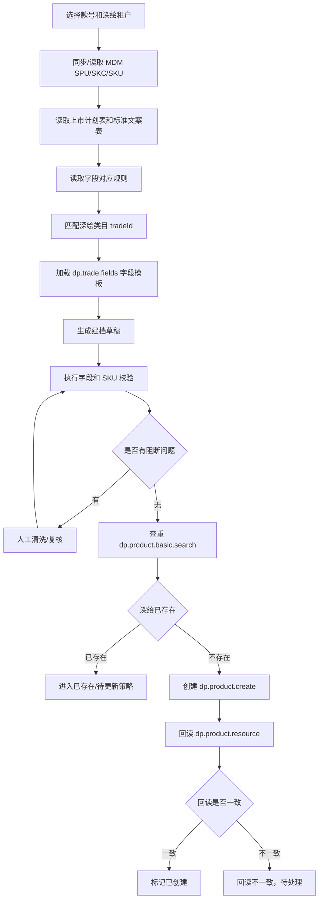
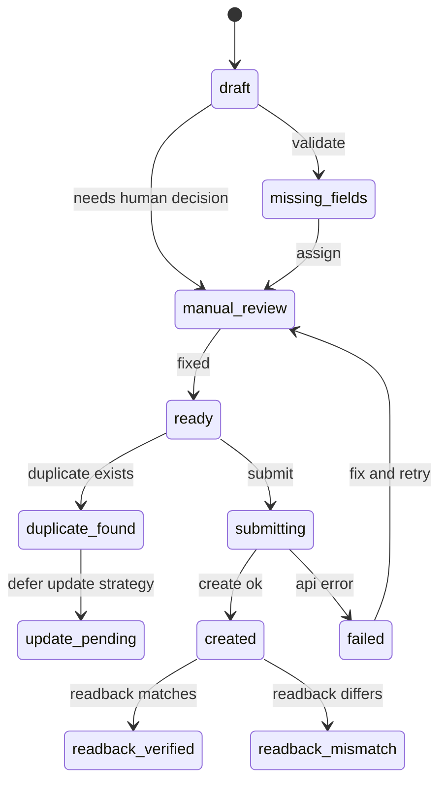

# 深绘商品档案建档功能设计

更新时间：2026-06-16

## 1. 结论

深绘商品档案建档不单独新起项目，作为 Listingify 的一个独立功能域新增。

推荐命名：

- 菜单：`深绘建档`
- 后端域名：`product-archive-drafts`
- 数据域：`product_archive_*`
- 对外定位：在 Listingify 商品事实层之上，完成“MDM/表格/文案/深绘字段模板 -> 建档草稿 -> 人工清洗 -> 深绘创建 -> 回读验收”的闭环。

原因：

- Listingify 已经有 MDM SPU/SKC/SKU 同步和落库能力。
- Listingify 已经有深绘内容包读取、签名请求、租户 credential 选择和回读落库能力。
- Listingify 已经有商品档案页面、同步队列、任务进度、权限、审计日志、PostgreSQL schema 版本化脚本和前后端工作台。
- 本功能是 Listingify 商品中台能力的自然延伸，不应复制一套外部系统对接和商品档案数据底座。

## 2. 背景

当前 Listingify 已经把商品中台与刊登中台的核心链路搭起来：

- MDM 主数据进入 `product_spu`、`product_skc`、`product_sku`。
- 深绘内容包进入 `product_content_package`、`product_content_field`、`product_content_skc`、`product_content_sku`、`product_asset`。
- 商品档案页面通过 `/api/product-archives/*` 联合展示 MDM 和深绘资料。
- 深绘内容包页面通过 `/api/deepdraw-content/*` 展示已同步内容包。
- 同步队列支持 MDM、深绘、MDM+深绘批量同步。

本次新增能力不是面向 SHEIN 的发布草稿，而是面向深绘平台的新建商品档案。它发生在平台刊登之前，目标是先把商品基础资料在深绘侧创建完整，再给后续图片、详情页、电商平台刊登提供事实源。

## 3. 目标与非目标

### 3.1 目标

1. 从 MDM、上市计划表、标准文案表、字段对应关系表合成深绘建档草稿。
2. 支持按深绘租户/商户选择 credential 和 `merchantId`。
3. 同步深绘类目树和类目字段模板，用字段模板校验草稿。
4. 支持人工补字段、复核类目、确认人工判断项。
5. 创建前执行查重，避免重复创建同货号商品。
6. 调用深绘 `dp.product.create` 创建商品档案。
7. 创建后调用 `dp.product.resource` 回读，验证本地草稿与深绘结果一致。
8. 保留提交日志、错误原因、request id、回读差异和重试记录。
9. 与 Listingify 现有商品档案页、同步任务页、操作日志保持一致。

### 3.2 非目标

本阶段不做：

- 图片、视频上传和维护。
- 详情页生成。
- 天猫、抖音、SHEIN、Temu 等平台上架。
- 深绘已存在商品的覆盖更新策略。
- 产品删除。
- 把深绘 credential 写入数据库明文或日志。

## 4. 当前可复用实现

| 能力 | 现有文件 | 复用方式 |
| --- | --- | --- |
| MDM token 与 SPU/SKU 查询 | `scripts/lib/mdm_client.mjs` | 继续使用 `MDM_BASE_URL`、`MDM_APP_ID`、`MDM_APP_KEY`，按 `spuCode` 查询 `PRODUCT_SPU` 和 `PRODUCT_SKU`。 |
| MDM 落库 | `scripts/lib/mdm_product_importer.mjs`、`db/migrations/003_mdm_product_master.sql` | `product_spu/product_skc/product_sku` 作为草稿主数据来源。 |
| 深绘 credential 解析 | `scripts/lib/deepdraw_client.mjs` | 继续支持 `DEEPDRAW_TENANT_CREDENTIALS_JSON`、单租户变量和本地私有文档 fallback。 |
| 深绘 GET 签名请求 | `scripts/lib/deepdraw_client.mjs` | 当前已支持 `GET /rest/v2`，可复用来做 `dp.product.resource` 回读和部分元数据查询。 |
| 深绘内容包同步 | `scripts/deepdraw_product_sync.mjs` | 作为批量回读脚本参考。 |
| 深绘内容落库 | `scripts/lib/deepdraw_content_importer.mjs`、`db/migrations/004_deepdraw_content_model.sql` | 创建后回读结果继续进入 `product_content_*` 表。 |
| 商品档案 API | `web/server/routes/product-archives.ts` | 保留只读/同步视图，新增入口跳到建档草稿。 |
| 深绘内容 API | `web/server/routes/deepdraw-content.ts` | 保留已存在内容包查询。 |
| 同步队列 | `scripts/lib/product_archive_sync_queue.mjs` | 复用批量款号、间隔、任务状态模型，扩展草稿生成/校验/提交任务。 |
| 权限与日志 | `web/server/routes/users.ts`、`web/server/lib/audit.ts` | 新增操作需要接入同一套 RBAC 和审计。 |

## 5. 用户与权限

| 角色 | 需要能力 |
| --- | --- |
| 运营 | 批量生成草稿、查看缺字段、补人工字段、提交审核。 |
| 商品/主数据人员 | 复核货号、品类、类目映射、价格、尺码和 SKU。 |
| 文案人员 | 维护标题、卖点、材质、细节文案等文案字段。 |
| 管理员 | 配置深绘租户、字段规则、类目映射、固定值和权限。 |
| 开发/运维 | 查看提交日志、request id、失败原因和重试记录。 |

权限建议：

| 权限 | 说明 |
| --- | --- |
| `product_archive_draft:read` | 查看草稿列表和详情。 |
| `product_archive_draft:write` | 生成草稿、编辑字段、解决校验问题。 |
| `product_archive_draft:approve` | 将草稿标记为可创建。 |
| `product_archive_draft:submit` | 调用深绘创建接口。 |
| `deepdraw_metadata:manage` | 同步类目和字段模板。 |
| `product_archive_rule:manage` | 导入和维护字段规则。 |

## 6. 信息架构

### 6.1 菜单结构

建议在 `商品中台` 或 `数据中心` 下新增：

- `深绘建档草稿`
- `深绘字段规则`
- `深绘类目字段`

现有页面关系：

| 页面 | 处理方式 |
| --- | --- |
| `商品档案` | 保留为 MDM + 深绘内容包的统一资料视图，新增“生成建档草稿”入口。 |
| `深绘内容包` | 保留为已存在深绘内容的只读结构化页面。 |
| `深绘建档草稿` | 新增，承接本次创建闭环。 |
| `同步任务` | 扩展展示草稿生成、校验、提交、回读任务。 |
| `操作日志` | 扩展记录字段编辑、审批、提交和失败重试。 |

### 6.2 草稿列表

列表字段：

- 草稿编号
- 款号
- 商品标题
- 深绘租户
- 商户 ID
- 深绘类目
- 状态
- 阻断问题数
- 警告数
- MDM 同步时间
- 深绘回读时间
- 创建 productId
- 更新时间

筛选：

- 关键词：款号、标题、类目、租户
- 状态：全部、缺字段、待人工判断、待审核、可创建、已存在、创建中、已创建、回读不一致、失败
- 租户
- 品牌
- 创建批次

批量动作：

- 批量生成草稿
- 批量校验
- 批量查重
- 批量提交
- 导出问题清单

### 6.3 草稿详情

详情页建议分为 6 个 tab：

| Tab | 内容 |
| --- | --- |
| `概览` | 款号、标题、租户、商户、类目、状态、阻断项摘要、来源同步时间。 |
| `字段填充` | 深绘字段、来源、目标值、是否必填、校验状态、人工覆盖入口。 |
| `SKU/颜色尺码` | MDM SKC/SKU、颜色格式、尺码、商家 SKU、条码、价格。 |
| `校验问题` | 阻断/警告/提示问题，支持定位字段和解决。 |
| `提交记录` | 查重、创建、回读日志，request id 和脱敏响应。 |
| `来源快照` | MDM 原始摘要、表格来源、文案来源、字段规则版本。 |

## 7. 核心流程



## 8. 状态机



状态定义：

| 状态 | 含义 |
| --- | --- |
| `draft` | 草稿已生成，尚未完成校验。 |
| `missing_fields` | 存在必填缺失。 |
| `manual_review` | 存在需要人工判断的字段或类目冲突。 |
| `ready` | 已通过阻断校验，可以查重和创建。 |
| `duplicate_found` | 深绘已有同货号商品。 |
| `update_pending` | 后续进入已存在商品更新策略，当前版本不覆盖。 |
| `submitting` | 正在调用深绘创建。 |
| `created` | 深绘创建成功，但尚未完成回读验收。 |
| `readback_verified` | 创建后回读与草稿目标值一致。 |
| `readback_mismatch` | 创建成功但回读字段与目标值不一致。 |
| `failed` | 创建或回读失败。 |

## 9. 数据模型

### 9.1 复用现有表

| 表 | 用途 |
| --- | --- |
| `product_spu` | 款号、品牌、季节、产品线、品类、性别、年龄、材质、吊牌价、标题补充字段。 |
| `product_skc` | 款色、颜色、款色图、代表价格。 |
| `product_sku` | SKU、尺码、条码、企业码、价格。 |
| `product_content_package` | 已有深绘资料、回读验收、深绘标题/类目/价格对比。 |
| `product_content_field` | 深绘已有字段值和关键字段候选。 |
| `product_content_skc`、`product_content_sku` | 深绘已有颜色、尺码、SKU 结构。 |
| `sync_batch` | 记录 MDM、深绘、草稿生成、提交批次。 |

### 9.2 新增表

#### `deepdraw_trade_cache`

缓存深绘类目树。

| 字段 | 说明 |
| --- | --- |
| `id` | 主键 |
| `tenant_name` | 深绘租户 |
| `merchant_id` | 商户 ID |
| `trade_id` | 深绘类目 ID |
| `parent_trade_id` | 父类目 ID |
| `trade_name` | 类目名称 |
| `trade_path` | 类目路径 |
| `raw_payload_json` | 原始节点 |
| `synced_at` | 同步时间 |

#### `deepdraw_trade_field_cache`

缓存类目字段模板。

| 字段 | 说明 |
| --- | --- |
| `id` | 主键 |
| `tenant_name` | 深绘租户 |
| `merchant_id` | 商户 ID |
| `trade_id` | 深绘类目 ID |
| `field_id` | 字段 ID |
| `field_name` | 字段名 |
| `field_type` | 字段类型 |
| `required` | 是否必填 |
| `sale_prop` | 是否销售属性 |
| `options_json` | 可选项 |
| `raw_payload_json` | 原始模板 |
| `synced_at` | 同步时间 |

#### `product_archive_source_batch`

记录字段对应表、上市计划表、标准文案表导入批次。

| 字段 | 说明 |
| --- | --- |
| `id` | 主键 |
| `batch_no` | 批次号 |
| `source_type` | `field_mapping` / `launch_plan` / `copywriting` |
| `file_name` | 文件名 |
| `sheet_name` | Sheet |
| `row_count` | 行数 |
| `raw_manifest_json` | 导入摘要 |
| `created_at` | 创建时间 |

#### `product_archive_field_rule`

字段来源规则。

| 字段 | 说明 |
| --- | --- |
| `id` | 主键 |
| `source_batch_id` | 来源批次 |
| `deepdraw_field` | 深绘字段 |
| `source_type` | `mdm` / `launch_plan` / `copywriting` / `fixed` / `manual` / `skip` |
| `source_table` | 来源表 |
| `source_field` | 来源字段 |
| `default_value` | 固定值 |
| `transform_rule_json` | 转换规则 |
| `blocking` | 是否阻断 |
| `notes` | 备注 |

#### `product_archive_draft`

SPU 级建档草稿。

| 字段 | 说明 |
| --- | --- |
| `id` | 主键 |
| `draft_no` | 草稿编号 |
| `spu_code` | MDM 款号 |
| `tenant_name` | 深绘租户 |
| `merchant_id` | 商户 ID |
| `trade_id` | 深绘叶子类目 |
| `trade_path` | 类目路径 |
| `title` | 标题 |
| `retail_price` | 吊牌价 |
| `status` | 状态 |
| `source_snapshot_json` | 来源快照 |
| `validation_summary_json` | 校验摘要 |
| `duplicate_result_json` | 查重结果 |
| `created_product_id` | 深绘 productId |
| `created_product_code` | 深绘 code |
| `created_at` | 创建时间 |
| `updated_at` | 更新时间 |

#### `product_archive_draft_field`

草稿字段。

| 字段 | 说明 |
| --- | --- |
| `id` | 主键 |
| `draft_id` | 草稿 ID |
| `field_name` | 深绘字段名 |
| `field_id` | 字段 ID |
| `source_type` | 来源类型 |
| `source_ref` | 来源定位 |
| `value_text` | 文本值 |
| `value_json` | 结构化值 |
| `required` | 是否必填 |
| `blocking` | 是否阻断 |
| `manual_override` | 是否人工覆盖 |
| `validation_status` | `valid` / `missing` / `invalid` / `skipped` |
| `validation_message` | 校验说明 |

#### `product_archive_draft_sku`

草稿 SKU。

| 字段 | 说明 |
| --- | --- |
| `id` | 主键 |
| `draft_id` | 草稿 ID |
| `spu_code` | 款号 |
| `skc_code` | 款色 |
| `sku_code` | SKU |
| `barcode` | 条码 |
| `color_name` | 颜色 |
| `color_code` | 颜色码 |
| `size_name` | 尺码 |
| `size_code` | 尺码码 |
| `price` | 价格 |
| `seller_code` | 商家编码 |
| `raw_payload_json` | 来源快照 |

#### `product_archive_validation_issue`

草稿校验问题。

| 字段 | 说明 |
| --- | --- |
| `id` | 主键 |
| `draft_id` | 草稿 ID |
| `severity` | `blocker` / `warning` / `info` |
| `issue_type` | 问题类型 |
| `field_name` | 字段名 |
| `sku_code` | SKU |
| `message` | 问题说明 |
| `resolved_at` | 解决时间 |

#### `product_archive_submit_log`

提交日志。

| 字段 | 说明 |
| --- | --- |
| `id` | 主键 |
| `draft_id` | 草稿 ID |
| `operation` | `search` / `create` / `resource` |
| `request_summary_json` | 脱敏请求摘要 |
| `http_status` | HTTP 状态 |
| `response_code` | 深绘业务 code |
| `response_reason` | 深绘 reason/message |
| `request_id` | request id |
| `product_id` | productId |
| `raw_response_json` | 脱敏响应 |
| `created_at` | 创建时间 |

## 10. 后端服务设计

新增服务建议：

| 服务 | 建议文件 | 职责 |
| --- | --- | --- |
| 深绘元数据服务 | `scripts/lib/deepdraw_metadata_client.mjs` | 调 `dp.merchant.trades`、`dp.trade.fields`，缓存类目和字段模板。 |
| 表格导入服务 | `scripts/lib/product_archive_source_importer.mjs` | 导入字段对应表、上市计划表、标准文案表。 |
| 字段规则服务 | `scripts/lib/product_archive_field_rules.mjs` | 根据 `product_archive_field_rule` 解析字段来源和转换策略。 |
| 草稿构建服务 | `scripts/lib/product_archive_draft_builder.mjs` | 从 MDM、表格、文案和固定值生成草稿。 |
| 校验服务 | `scripts/lib/product_archive_validator.mjs` | 执行必填、选项、颜色、尺码、SKU、价格校验。 |
| 提交服务 | `scripts/lib/deepdraw_product_submitter.mjs` | 查重、创建、回读、记录提交日志。 |
| 路由层 | `web/server/routes/product-archive-drafts.ts` | 暴露草稿相关 API。 |
| 元数据路由 | `web/server/routes/deepdraw-metadata.ts` | 暴露类目和字段模板 API。 |

### 10.1 深绘 Client 扩展

当前 `scripts/lib/deepdraw_client.mjs` 已有：

- `resolveDeepdrawConfig`
- `buildDeepdrawGetRequest`
- `requestDeepdraw`
- `getDeepdrawProduct`

需要新增：

- `searchDeepdrawProductBasic`
- `createDeepdrawProduct`
- `getDeepdrawTrades`
- `getDeepdrawTradeFields`

注意：

- 如果 `dp.product.create` 可以通过同一套 `/rest/v2` 签名参数完成，就扩展 JS client。
- 如果创建接口必须使用 Java SDK 的 `Product`、`addProductField` 等对象模型，则使用 `vendor/deepdraw-sdk` 做 Java Adapter。
- 无论走 JS 还是 Java，路由层都只调用统一的 `deepdraw_product_submitter`，避免前端感知实现差异。

### 10.2 Credential 选择

规则：

1. 请求带 `deepdrawTenantName` 时，优先从 `DEEPDRAW_TENANT_CREDENTIALS_JSON` 取配置。
2. 请求未带租户时，使用 `DEEPDRAW_TENANT_NAME`。
3. JSON 不存在对应租户时，退回单租户 `DEEPDRAW_APP_KEY`、`DEEPDRAW_APP_SECRET`、`DEEPDRAW_DOP_KEY`、`DEEPDRAW_MERCHANT_ID`。
4. 本地开发允许 `DEEPDRAW_CREDENTIAL_DOC` fallback；生产不建议依赖文档读取。

日志只允许保存：

- `tenant_name`
- `merchant_id`
- `credential_source`
- `request_id`
- `response_code`
- `response_reason`

禁止保存：

- `appSecret`
- `dopKey`
- 完整签名串
- 完整请求 header
- `.env.local` 原文

## 11. API 设计

### 11.1 现有 API 保持

| API | 状态 | 用途 |
| --- | --- | --- |
| `GET /api/product-archives` | 已有 | 商品档案列表。 |
| `GET /api/product-archives/summary` | 已有 | MDM/深绘同步覆盖统计。 |
| `GET /api/product-archives/config` | 已有 | 品牌映射和深绘租户选项。 |
| `POST /api/product-archives/sync-jobs` | 已有 | 批量同步 MDM/深绘。 |
| `GET /api/product-archives/:spuCode` | 已有 | 商品档案详情。 |
| `GET /api/deepdraw-content/:spuCode` | 已有 | 深绘内容包详情。 |

### 11.2 新增 API

| API | 方法 | 请求 | 响应 | 说明 |
| --- | --- | --- | --- | --- |
| `/api/product-archive-drafts` | `GET` | `q/status/tenant/limit/offset` | 草稿列表 | 支持列表筛选和分页。 |
| `/api/product-archive-drafts/from-spu/:spuCode` | `POST` | `{ deepdrawTenantName, sourceBatchId? }` | 草稿摘要 | 从 MDM 和规则生成单款草稿。 |
| `/api/product-archive-drafts/batch` | `POST` | `{ codes, deepdrawTenantName, intervalMs }` | job | 批量生成草稿。 |
| `/api/product-archive-drafts/:draftId` | `GET` | 无 | 草稿详情 | 返回字段、SKU、问题和日志。 |
| `/api/product-archive-drafts/:draftId/fields` | `PATCH` | `{ fields: [...] }` | 草稿详情 | 人工补值或覆盖。 |
| `/api/product-archive-drafts/:draftId/validate` | `POST` | 无 | 校验结果 | 重算字段和 SKU 校验。 |
| `/api/product-archive-drafts/:draftId/check-duplicate` | `POST` | 无 | 查重结果 | 调 `dp.product.basic.search`。 |
| `/api/product-archive-drafts/:draftId/submit` | `POST` | `{ dryRun?: boolean }` | 提交结果 | 调 `dp.product.create`。 |
| `/api/product-archive-drafts/:draftId/readback` | `POST` | 无 | 回读结果 | 调 `dp.product.resource` 并导入内容包。 |
| `/api/product-archive-drafts/:draftId/logs` | `GET` | 无 | 日志列表 | 查重、创建、回读日志。 |
| `/api/deepdraw-metadata/trades` | `GET` | `tenantName?` | 类目树 | 查询或刷新类目。 |
| `/api/deepdraw-metadata/trades/:tradeId/fields` | `GET` | `tenantName?` | 字段模板 | 查询或刷新类目字段。 |

### 11.3 提交接口规则

`POST /api/product-archive-drafts/:draftId/submit` 必须执行：

1. 校验草稿状态。
2. 若未通过校验，先执行 `validate`。
3. 存在 `blocker` 时拒绝提交。
4. 先执行 `check-duplicate`。
5. 查重命中时默认拒绝创建，状态转为 `duplicate_found`。
6. `dryRun=true` 时只返回拟提交摘要，不请求深绘创建。
7. 创建成功后写入 `product_archive_submit_log`。
8. 创建成功后自动执行 `readback`。
9. 回读不一致时状态为 `readback_mismatch`，不标记完成。

## 12. 字段合成规则

字段来源类型：

| 类型 | 来源 | 处理方式 |
| --- | --- | --- |
| `mdm` | `product_spu/product_skc/product_sku` | 自动取值。 |
| `launch_plan` | 上市计划表 | 按款号、款色、上市渠道匹配。 |
| `copywriting` | 标准文案表 | 按款号/款色取标题、卖点、材质、细节文案。 |
| `fixed` | 固定配置 | 从规则表取默认值。 |
| `manual` | 人工判断 | 生成空值或建议值，进入人工清洗。 |
| `skip` | 本期不填 | 创建 payload 中跳过。 |

关键合成：

- `Product.code`：默认使用 MDM `spu_code`，业务确认前不要改成 SKC。
- `Product.title`：优先标准文案表 `搜索标题`，兜底 MDM 款名，缺失阻断。
- `retailPrice`：优先 MDM `price_tag`，与 SKU 价格不一致时预警。
- `tradeId`：优先人工确认的深绘类目映射，未确认时阻断。
- `颜色`：从 SKC/SKU 颜色聚合，生成深绘要求的颜色别名格式。
- `尺码`：从 SKU 尺码聚合。
- `商家 SKU`：从 SKU 编码、颜色、尺码、条码、价格构造。
- 平台字段：第一版只填通用字段和明确要求字段，非必填平台字段可作为警告。

## 13. 校验规则

阻断校验：

- 缺 `spu_code`。
- 缺标题。
- 缺 `tradeId`。
- 深绘字段模板不存在但草稿试图提交。
- 深绘必填字段缺失。
- 单选/多选值不在字段模板选项中。
- 传商家 SKU 时缺颜色或尺码。
- SKU 尺码不存在于尺码字段。
- SKU 颜色不存在于颜色字段。
- 查重命中且未进入更新策略。

警告校验：

- MDM 类目与上市计划表类目不一致。
- SPU 价格与 SKU 价格不一致。
- 标准文案缺平台标题。
- 人工判断字段为空但非必填。
- 深绘已有内容包与新草稿标题、类目或价格不一致。

## 14. 前端设计

### 14.1 深绘建档草稿列表

布局沿用 Listingify 管理后台风格：顶部筛选、批量动作、服务端分页表格。

主要操作：

- `生成草稿`
- `批量生成`
- `批量校验`
- `批量查重`
- `批量提交`
- `导出问题`

状态展示：

- 使用现有 `StatusBadge` 风格。
- 阻断项用红色数字，警告用黄色数字。
- 已创建显示 `productId` 和回读状态。

### 14.2 草稿详情

详情页使用紧凑工作台，不做营销式页面。

核心区域：

- 顶部：款号、标题、状态、租户、类目、关键动作。
- 左侧或首屏：阻断问题摘要。
- Tab：概览、字段填充、SKU/颜色尺码、校验问题、提交记录、来源快照。

字段填充表：

| 列 | 说明 |
| --- | --- |
| 字段名 | 深绘字段名 |
| 来源 | MDM/上市计划/文案/固定/人工/跳过 |
| 目标值 | 将提交给深绘的值 |
| 必填 | 字段模板必填 |
| 状态 | 通过、缺失、无效、跳过 |
| 操作 | 编辑、恢复系统值、查看来源 |

### 14.3 元数据和规则页

`深绘类目字段`：

- 租户选择。
- 类目树。
- 字段模板列表。
- 刷新按钮。
- 字段类型、必填、选项展示。

`深绘字段规则`：

- 导入字段对应表。
- 规则列表。
- 字段来源类型筛选。
- 阻断策略维护。
- 固定值维护。

## 15. 安全与审计

安全要求：

- `.env.local` 不进入 Git。
- 前端不返回 `appSecret`、`dopKey`、`MDM_APP_KEY`。
- 日志不保存完整请求 header、签名串、密钥。
- 提交 payload 日志只保存字段名、字段数量、脱敏摘要和业务返回。
- 所有创建操作必须写操作日志。
- 只有具备 `product_archive_draft:submit` 权限的用户可以调用真实创建。

审计事件：

| 事件 | 内容 |
| --- | --- |
| `draft.created` | 款号、租户、来源批次、创建人。 |
| `draft.field.updated` | 字段名、旧值摘要、新值摘要、原因。 |
| `draft.validated` | 阻断数、警告数。 |
| `draft.approved` | 审核人、时间。 |
| `draft.submit.dry_run` | 草稿 ID、字段数、SKU 数。 |
| `draft.submit.create` | 草稿 ID、request id、productId。 |
| `draft.readback.verified` | 回读通过。 |
| `draft.readback.mismatch` | 差异摘要。 |
| `draft.submit.failed` | 脱敏失败原因。 |

## 16. 实施计划

### P0：只读链路确认

目标：确认 MDM 和深绘现有同步可用。

工作：

- 用现有 `/api/product-archives/:spuCode/sync/mdm` 同步样本款号。
- 用现有 `/api/product-archives/:spuCode/sync/deepdraw` 回读样本款号。
- 确认 `/api/product-archives/:spuCode` 同时返回 MDM 与深绘资料。

验收：

- MDM 有 SPU/SKC/SKU。
- 深绘有内容包或明确返回不存在。
- 错误信息不泄漏密钥。

### P1：元数据和规则

工作：

- 新增 `deepdraw_trade_cache`、`deepdraw_trade_field_cache`。
- 新增 `product_archive_source_batch`、`product_archive_field_rule`。
- 新增 `deepdraw_metadata_client`。
- 新增字段对应表导入。
- 新增元数据 API。

验收：

- 能按租户同步类目。
- 能按 `tradeId` 查看字段模板。
- 字段对应规则可查询。

### P2：草稿和校验

工作：

- 新增草稿、字段、SKU、校验问题表。
- 新增草稿构建服务。
- 新增校验服务。
- 新增草稿列表和详情 API。

验收：

- 单个样本款号能生成草稿。
- 阻断问题能定位到字段或 SKU。
- `validate` 可重复执行且结果幂等。

### P3：人工清洗

工作：

- 新增草稿列表页。
- 新增草稿详情页。
- 支持字段编辑、恢复系统值、解决问题。
- 支持审核为 `ready`。

验收：

- 人工补字段后可重新校验通过。
- 修改有审计日志。

### P4：创建和回读

工作：

- 新增 `deepdraw_product_submitter`。
- 扩展深绘 client 或接入 Java SDK Adapter。
- 新增查重、提交、回读 API。
- 新增提交日志表。

验收：

- `dryRun` 可预览。
- 查重命中不重复创建。
- 创建成功保存 `productId`。
- 回读一致后状态为 `readback_verified`。

### P5：批量任务

工作：

- 扩展队列任务类型。
- 支持批量生成、校验、提交。
- 同步任务页展示进度。
- 支持失败重试。

验收：

- 支持最多 500 个款号。
- 支持请求间隔限流。
- 每个款号有独立状态和错误原因。

## 17. 测试计划

单元测试：

- `deepdraw_client.test.mjs`：credential 选择、签名参数、错误脱敏。
- `product_archive_field_rules.test.mjs`：字段来源解析、固定值、人工字段、跳过字段。
- `product_archive_draft_builder.test.mjs`：MDM + 表格 + 文案合成。
- `product_archive_validator.test.mjs`：必填、选项、颜色、尺码、SKU、价格校验。
- `deepdraw_product_submitter.test.mjs`：dry-run、查重、创建、回读状态转换。

路由测试：

- 草稿列表分页。
- 单款生成草稿。
- 字段编辑。
- 校验。
- 查重。
- dry-run 提交。
- 创建失败脱敏。

UI 测试：

- 草稿列表筛选和分页。
- 草稿详情 tab。
- 字段编辑弹窗。
- 校验问题定位。
- 批量任务进度。

回归测试：

```bash
npm test
npm run web:build
```

## 18. 交付物

第一轮交付应包含：

- PostgreSQL schema 建表/版本脚本。
- 字段对应表导入脚本。
- 深绘元数据同步服务和 API。
- 草稿构建和校验服务。
- 草稿列表页和详情页。
- dry-run 和查重。

第二轮交付：

- `dp.product.create` 真实创建。
- 创建后回读验收。
- 批量提交。
- 审计和操作日志接入。

第三轮交付：

- 已存在商品更新策略。
- 图片/详情页阶段接入。
- 与 SHEIN/Temu 发品链路的状态联动。

## 19. 风险与决策点

| 风险 | 影响 | 处理 |
| --- | --- | --- |
| `dp.product.create` HTTP 形态不明确 | JS client 可能无法直接创建 | 先做 dry-run 和查重；创建阶段预留 Java SDK Adapter。 |
| 货号粒度未确认 | SPU/SKC 错建或重复建档 | 第一版默认 SPU，提交前业务确认。 |
| 类目映射不稳定 | 字段模板错误 | 类目必须人工确认后进入 `ready`。 |
| 人工字段过多 | 自动化比例低 | 只阻断必填字段，非必填人工字段作为 warning。 |
| 深绘字段选项变化 | 创建失败 | 创建前刷新字段模板或检查缓存时间。 |
| 多租户 credential 混用 | 创建到错误商户 | 草稿固定 `tenant_name/merchant_id`，提交前二次确认。 |
| 回读不一致 | 深绘接受但字段被规范化或忽略 | 进入 `readback_mismatch`，保留差异清单。 |

## 20. 待确认问题

1. 深绘创建粒度最终是 SPU 还是 SKC。
2. `Product.code` 使用 MDM `spu_code`、大货款号，还是商品品种编号。
3. 已存在商品第一版是否完全不更新。
4. 哪些人工判断字段必须阻断创建。
5. 第一版是否只创建通用字段，平台字段后补。
6. `dp.product.create` 是否可以用现有 `/rest/v2` 签名方式，还是必须走 Java SDK。
7. 类目映射由规则自动推荐还是必须人工选择。

## 21. 推荐开发入口

优先新增这些文件：

```text
db/migrations/024_deepdraw_product_archive_creation.sql
scripts/lib/deepdraw_metadata_client.mjs
scripts/lib/product_archive_source_importer.mjs
scripts/lib/product_archive_field_rules.mjs
scripts/lib/product_archive_draft_builder.mjs
scripts/lib/product_archive_validator.mjs
scripts/lib/deepdraw_product_submitter.mjs
web/server/routes/deepdraw-metadata.ts
web/server/routes/product-archive-drafts.ts
web/src/pages/deepdraw-metadata/page.tsx
web/src/pages/product-archive-drafts/page.tsx
web/src/pages/product-archive-drafts/[draftId]/page.tsx
```

同时在现有位置接线：

```text
web/server/index.ts
web/src/router.tsx
web/src/components/layout/app-sidebar.tsx
scripts/lib/deepdraw_client.mjs
scripts/lib/product_archive_sync_queue.mjs
```

## 22. 最终判断

深绘商品档案建档应作为 Listingify 的商品事实层增强，而不是新项目。

本功能完成后，Listingify 的商品链路会变成：

```text
MDM / 表格 / 文案 / 深绘字段模板
  -> 深绘建档草稿
  -> 人工清洗与校验
  -> 深绘商品档案创建
  -> 深绘回读验收
  -> 后续图片、详情页、SHEIN/Temu 平台刊登
```

这条链路能把 Listingify 从“读取已有深绘资料”推进到“主动创建并治理深绘商品档案”，是商品中台能力的关键补齐。
