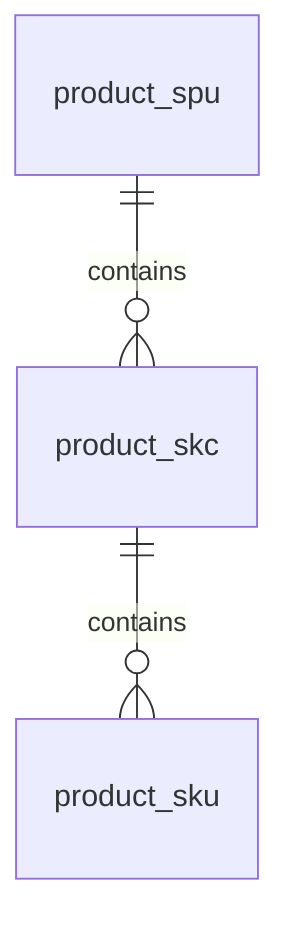

# MDM 商品主数据建模

更新时间：2026-04-29

## 背景

MDM 当前提供两个开放查询接口：

- SPU 查询：`/demdm-api/open/api/v2/selectApi/SAP_SPU`
- SKU 查询：`/demdm-api/open/api/v2/selectApi/SKU_LIST`

接口中没有独立 SKC 查询接口。SKC 需要从 SKU 查询结果中按 `SKC_CODE` 聚合生成，因此 Listingify 内部商品主数据层级定义为：

## 层级定义

| 层级 | 来源 | 主键 | 含义 |
| --- | --- | --- | --- |
| SPU | SPU 接口 `DATA[]` | `MDM_CODE` | 款号，承载品牌、年份季节、品类、性别年龄段、面料、价格等款级属性 |
| SKC | SKU 接口 `DATA[]` 聚合 | `SKC_CODE` | 款色，按颜色维度归组 SKU，承载颜色、款色图、款色名称 |
| SKU | SKU 接口 `DATA[]` | `SKU_CODE` | 具体可售规格，通常是款号 + 色号 + 尺码，承载尺码、条码、企业码 |

## 关系规则

1. `product_spu.spu_code = SPU.DATA[].MDM_CODE`
2. `product_skc.spu_id -> product_spu.id`
3. `product_skc.skc_code = SKU.DATA[].SKC_CODE`
4. `product_sku.skc_id -> product_skc.id`
5. `product_sku.sku_code = SKU.DATA[].SKU_CODE`
6. 同一个 `MDM_CODE` 下，同一个 `SKC_CODE` 只生成一个 SKC。
7. 同一个 `SKC_CODE` 下，不同 `SIZE_CODE` 生成不同 SKU。

## 字段映射

### SPU

| 本地字段 | MDM 字段 | 说明 |
| --- | --- | --- |
| `spu_code` | `MDM_CODE` | 款号 |
| `spu_name` | `MULTI_LANG[LANG=zh-CN].MDM_NAME`，兜底 `MDM_NAME` | 中文款名 |
| `spu_name_en` | `MULTI_LANG[LANG=en-US].MDM_NAME` | 英文款名 |
| `listing_title_cn` / `listing_title_en` | Excel `中文标题` / `英文标题` | 上货标题，SPU 维度补充资料 |
| `shein_spu_code` | Excel `spu` | SHEIN 侧 SPU 编码/占位字段，当前样例为空 |
| `shein_category_name` | Excel `SHEIN分类` | SHEIN 类目人工整理字段，当前样例为空 |
| `old_style_code` | Excel `老款号`，MDM `OLD_ARTICLE_NUMBER` | 旧款号，当前两款 MDM 样例为空 |
| `deepdraw_info_status` | Excel `深绘已有信息` | 人工整理字段，当前样例为空 |
| `brand_code` / `brand_name` | `BRAND_CODE` / `BRAND_DESC` | 品牌 |
| `year` | `YEAR` | 年份 |
| `season_code` / `season_name` | `SEASON_CODE` / `SEASON_DESC` | 季节 |
| `product_chain_code` / `product_chain_name` | `PRODUCT_CHAIN_CODE` / `PRODUCT_CHAIN_DESC` | 产品链/大类 |
| `product_line_code` / `product_line_name` | `PRODUCT_LINE_CODE` / `PRODUCT_LINE_DESC` | 产品线 |
| `middle_class_code` / `middle_class_name` | `MIDDLE_CLASS_CODE` / `MIDDLE_CLASS_DESC` | 中类 |
| `subclass_code` / `subclass_name` | `SUBCLASS_CODE` / `SUBCLASS_DESC` | 小类 |
| `gender_code` / `gender_name` | `SEX_CODE` / `SEX_DESC` | 性别 |
| `age_group_code` / `age_group_name` | `AGE_GROUP_CODE` / `AGE_GROUP_DESC` | 年龄段 |
| `version_number` | `VERSION_NUMBER` | 版单号/楦号 |
| `model_code` / `model_name` | `MODEL_CODE` / `MODEL_DESC` | 版型/鞋型 |
| `length_code` / `length_name` | `LENGTH_CODE` / `LENGTH_DESC` | 长度 |
| `price_range_code` / `price_range_name` | `PRICE_RANGE_CODE` / `PRICE_RANGE_DESC` | 价格档 |
| `product_positioning_code` / `product_positioning_name` | `PRODUCT_POSITIONING_CODE` / `RODUCT_POSITIONING_DESC` | 商品定位；MDM 返回字段名中描述字段少了首字母 P |
| `purchase_group_code` / `purchase_group_name` | `PURC_GROUP_CODE` / `PURC_GROUP_DESC` | 采购组 |
| `purchase_pattern_code` / `purchase_pattern_name` | `PURC_PATT_CODE` / `PURC_PATT_DESC` | 采购模式 |
| `scene_code` / `scene_name` | `SCENE_CODE` / `SCENE_DESC` | 场景 |
| `is_continue_code` / `is_continue_name` | `IS_CONTINUE_CODE` / `IS_CONTINUE_DESC` | 是否延续款 |
| `is_ip_code` / `is_ip_name` | `IS_IP_CODE` / `IS_IP_DESC` | 是否 IP |
| `is_mental_products_code` / `is_mental_products_name` | `IS_MENTAL_PRODUCTS_CODE` / `IS_MENTAL_PRODUCTS_DESC` | 是否心智产品 |
| `is_uni_size_code` / `is_uni_size_name` | `IS_UNI_SIZE_CODE` / `IS_UNI_SIZE_DESC` | 是否通码 |
| `price_tag` | `PRICE_TAG` | 挂牌价 |
| `pic_url` | `PIC_URL` | MDM 商品图 |
| `status_code` / `status_name` | `STATUS_CODE` / `STATUS_DESC` | 物料状态 |
| `enable_status` | `ENABLE_STATUS` | 启用状态 |
| `data_status` | `DATA_STATUS` | 数据状态 |
| `approve_status` | `APPROVE_STATUS` | 审批状态 |
| `multi_lang_json` | `MULTI_LANG` | 多语言原始数组 |
| `channel_level` | `MULTI_LANG[LANG=zh-CN].CHANNEL_LEVEL` | 渠道层级 |
| `filler` | `MULTI_LANG[LANG=zh-CN].FILLER` | 填充物 |
| `spu_group` | `MULTI_LANG[LANG=zh-CN].SPU_GROUP` | 组别 |
| `raw_payload_json` | 整条 SPU 记录 | 原始记录留存 |

### SKC

SKC 没有独立 MDM 接口，由 SKU 记录派生：

| 本地字段 | MDM 字段 | 说明 |
| --- | --- | --- |
| `skc_code` | `SKC_CODE` | 款色编码 |
| `skc_name` | `MULTI_LANG[LANG=zh-CN].SKC_NAME` | 中文款色名称 |
| `skc_name_en` | `MULTI_LANG[LANG=en-US].SKC_NAME` | 英文款色名称 |
| `color_code` / `color_name` | `COLOR_CODE` / `COLOR_DESC` | 颜色 |
| `pic_url` | `PIC_URL` | 代表图，取该 SKC 下首条或最新 SKU 图片 |
| `price_tag` | `PRICE_TAG` | 款色代表挂牌价 |
| `status_code` / `status_name` | `STATUS_CODE` / `STATUS_DESC` | 款色下 SKU 的代表状态 |
| `multi_lang_json` | `MULTI_LANG` | 代表 SKU 的多语言数组 |
| `raw_payload_json` | 代表 SKU 记录或聚合摘要 | 原始记录留存 |

聚合时建议按 `SKC_CODE` 分组，优先选择 `last_update_date` 最新的 SKU 作为 SKC 代表记录。

### SKU

| 本地字段 | MDM 字段 | 说明 |
| --- | --- | --- |
| `sku_code` | `SKU_CODE` | SKU 编码 |
| `sku_name` | `MULTI_LANG[LANG=zh-CN].SKU_NAME` | 中文 SKU 名称 |
| `sku_name_en` | `MULTI_LANG[LANG=en-US].SKU_NAME` | 英文 SKU 名称 |
| `supplier_product_code` | `SUPPLIER_PRODUCT_CODE` | 供应商商品条码，接口有字段但当前样例为空 |
| `inner_code` | `INNER_CODE` | 企业码 |
| `ean_code` | `EAN_CODE` | 国际码/条码 |
| `size_code` / `size_name` | `SIZE_CODE` / `SIZE_DESC` | 尺码 |
| `shein_size_name` | Excel `SHEIN尺码-录入` | SHEIN 录入尺码，人工/转换表补充 |
| `color_code` / `color_name` | `COLOR_CODE` / `COLOR_DESC` | 冗余颜色，便于 SKU 层查询 |
| `price_tag` | `PRICE_TAG` | SKU 挂牌价 |
| `supply_price_cny` | Excel `供货价(人民币)` | 供货价 |
| `suggested_retail_price_usd` | Excel `建议零售价(美元)` | 建议零售价 |
| `gross_weight_g` | Excel `产品毛重/g` | 商品毛重 |
| `supply_discount` | Excel `供货折扣` | 供货折扣 |
| `package_size_text` | Excel `含包装尺寸` | 包装尺寸文本 |
| `brand_code` / `brand_name` | SKU 接口 `BRAND_CODE` / `BRAND_DESC` | SKU 原始返回也带品牌，冗余保存 |
| `year` / `season_code` / `season_name` | SKU 接口 `YEAR` / `SEASON_CODE` / `SEASON_DESC` | SKU 原始返回也带年份季节，冗余保存 |
| `is_ip_code` / `is_ip_name` | SKU 接口 `IS_IP_CODE` / `IS_IP_DESC` | SKU 原始返回是否 IP |
| `pic_url` | `PIC_URL` | SKU 图片 |
| `status_code` / `status_name` | `STATUS_CODE` / `STATUS_DESC` | 物料状态 |
| `multi_lang_json` | `MULTI_LANG` | 多语言原始数组 |
| `raw_payload_json` | 整条 SKU 记录 | 原始记录留存 |

## 示例数据关系

正式环境联调中，款号 `208226102001` 返回：

| 层级 | 数量 | 示例 |
| --- | --- | --- |
| SPU | 1 | `208226102001` |
| SKC | 1 | `20822610200100311`，颜色 `白色调00311` |
| SKU | 12 | `20822610200100311080`、`20822610200100311090` 等 |

款号 `208226103201` 返回：

| 层级 | 数量 | 示例 |
| --- | --- | --- |
| SPU | 1 | `208226103201` |
| SKC | 1 | `20822610320100313`，颜色 `白黄色调00313` |
| SKU | 12 | `20822610320100313080`、`20822610320100313090` 等 |

## 落库策略

1. 先查询 SPU 接口，按 `MDM_CODE` upsert `product_spu`。
2. 再查询 SKU 接口，按 `SKC_CODE` 聚合 upsert `product_skc`。
3. 最后按 `SKU_CODE` upsert `product_sku`。
4. 每条记录计算 `source_hash`，当原始 payload 未变化时可跳过更新。
5. 所有接口原始记录保存在 `raw_payload_json`，解析字段只承载高频检索、映射和发品需要的字段。
6. 类目映射使用 SPU 层的 `middle_class_name + subclass_name + gender_name + age_group_name` 组合匹配。

## 查询视图

迁移 `003_mdm_product_master.sql` 提供基础视图，`005_mdm_product_master_field_expansion.sql` 已扩展 Excel 补充字段和 MDM 非空字段：

| 视图 | 用途 |
| --- | --- |
| `v_product_skc_summary` | 按 SPU/SKC 查看款色和 SKU 数量 |
| `v_product_sku_flat` | 拉平成 SKU 维度，供发品草稿、校验和导出使用 |

## Excel 字段差异

文件 `标题SHEIN上货资料20260421-外包上款迷你(1).xlsx` 中：

- `Sheet2` 第 2 行是主表表头，第 3 行起是 SKU 粒度数据，共 352 条非空 SKU 行。
- `Sheet4` 是标题清单，三列分别可理解为 `款号 / 中文标题 / 英文标题`，共 27 个款号。

已升列字段：

| Excel 字段 | 本地字段 |
| --- | --- |
| `spu` | `product_spu.shein_spu_code` |
| `SHEIN分类` | `product_spu.shein_category_name` |
| `老款号` | `product_spu.old_style_code` |
| `深绘已有信息` | `product_spu.deepdraw_info_status` |
| `产品线描述` | `product_spu.product_line_name` |
| `SKC描述` | `product_skc.skc_name` 或 `product_sku.sku_name` |
| `性别描述` | `product_spu.gender_name` |
| `季节描述` | `product_spu.season_name` |
| `中类描述` | `product_spu.middle_class_name` |
| `款号` | `product_spu.spu_code` |
| `SKC编码` | `product_skc.skc_code` |
| `企业码` | `product_sku.inner_code` |
| `SKC图片` | `product_skc.pic_url` |
| `SHEIN尺码-录入` | `product_sku.shein_size_name` |
| `供货价(人民币)` | `product_sku.supply_price_cny` |
| `建议零售价(美元)` | `product_sku.suggested_retail_price_usd` |
| `产品毛重/g` | `product_sku.gross_weight_g` |
| `颜色编码` / `颜色描述` | `product_skc.color_code` / `product_skc.color_name`，并冗余到 `product_sku` |
| `小类描述` | `product_spu.subclass_name` |
| `面种描述` | `product_spu.fabric_type_name` |
| `尺码编码` / `尺码描述` | `product_sku.size_code` / `product_sku.size_name` |
| `年份` | `product_spu.year`，并冗余到 `product_sku.year` |
| `挂牌单价` | `product_spu.price_tag` / `product_sku.price_tag` |
| `供货折扣` | `product_sku.supply_discount` |
| `含包装尺寸` | `product_sku.package_size_text` |
| `中文标题` / `英文标题` | `product_spu.listing_title_cn` / `product_spu.listing_title_en` |

当前 Excel 中 `spu`、`SHEIN分类`、`老款号`、`深绘已有信息` 四列在样例数据里为空，但已预留结构化列，便于后续人工补齐或导入。

## 暂缓升列字段

正式环境两个样例款中，下列 MDM 字段在 SPU 或 SKU 返回中为空，暂时只保留在 `raw_payload_json`：

- SPU：`CHANNEL_RD_PROP_DESC`、`COLLAR_SHAPE_DESC`、`DETAILS_DESC`、`DISABLED_DATE`、`FOOT_OPENING_DESC`、`IP_CARTOON_DESC`、`IP_TYPE_DESC`、`LIVE_PROP_DESC`、`MERGE_MDM_ID`、`ORDER_PROP_DESC`、`PLANE_DESC`、`PRODUCT_GROUP_DESC`、`SILHOUETTE_DESC`、`SLEEVE_SHAPE_DESC`、`STITCHES_NUMBER_DESC`、`STYLE_LINE_DESC`、`SUPPLY_TYPE_DESC`、`WAIST_HEIGHT_DESC`、`WAIST_SHAPE_DESC`、`WASH_WATER_DESC`
- SKU：`DISABLED_DATE`、`ENABLED_DATE`、`IP_CARTOON_DESC`、`IP_TYPE_DESC`、`MERGE_MDM_ID`、`NEXT_APPROVE_ID`、`SUPPLY_TYPE_DESC`
