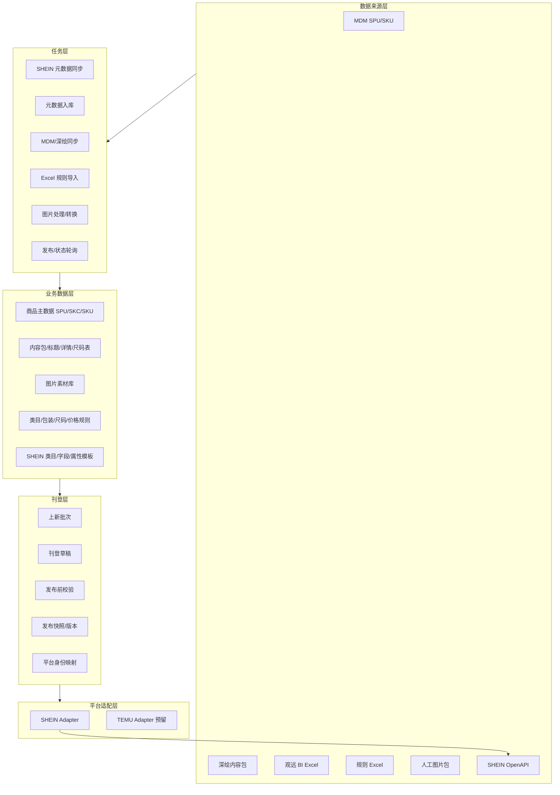

# 项目架构、能力范围与界面建议

日期：2026-04-27

## 1. 项目定位

本项目第一阶段定位为 SHEIN 全托管上新中台。目标不是替代完整 ERP，而是把 MDM、深绘、Excel 人工规则、图片补齐、价格确认、SHEIN 发布校验和发布追踪串成一个可审计、可回溯、可批量操作的发品工作台。

MVP 聚焦：

- SHEIN 全托管商品发布。
- MDM + 深绘 + Excel + 人工补齐的数据汇聚。
- 发品草稿生成、校验、发布 payload 预览。
- 发布版本、请求响应、状态追踪。

MVP 暂不覆盖：

- TEMU 实际发布。
- SHEIN 订单、履约、库存、财务对账。
- 自动设计/裁剪商品图片。
- 自动生成全部属性映射。
- 完整 ERP 主数据治理。

## 2. 总体架构



## 3. 模块拆分

| 模块 | 核心职责 | 当前状态 |
| --- | --- | --- |
| SHEIN OpenAPI 客户端 | 签名、请求、重试、验签头、接口探查 | 已完成基础脚本 |
| SHEIN 元数据同步 | 拉类目树、发布字段规范、属性模板、枚举值 | 已完成脚本和一次真实同步 |
| 元数据数据库 | 承接 SHEIN 类目、字段、图片规则、属性模板、枚举值 | 已完成 SQLite 迁移、导入、查询 |
| 类目映射规则 | MDM 中类 + 小类 + 性别 + 年龄段映射 SHEIN 末级类目 | 表结构已修正，待做导入和维护 |
| MDM 同步 | SPU/SKC/SKU 主数据同步、清洗、归一 | 待开发 |
| 深绘同步 | 标题、详情页、图片、尺码表、属性内容同步 | 待开发 |
| Excel 规则导入 | 毛重、尺码转换、包装规则、低倍率清单、类目映射 | 待开发 |
| 图片素材管理 | SKC 图片包上传、用途标记、SHEIN URL 转换 | 待开发 |
| 草稿生成 | 按款号生成 listing/listing_skc/listing_sku | 待开发 |
| 发布校验 | 必填字段、属性枚举、图片、价格、包装、SKU 重复校验 | 待开发 |
| 发布版本 | 保存快照、请求、响应、traceId、失败原因 | 待开发 |
| 状态追踪 | 轮询审核状态，失败后新版本重提 | 待开发 |

## 4. 能力范围

### 4.1 数据底座能力

- 管理 SHEIN 店铺可发布类目。
- 查询 SHEIN 叶子类目的 `category_id` 和 `product_type_id`。
- 查询类目发布字段规范，包括 `required` 和 `show`。
- 查询图片规则，例如 SKC 细节图、方形图是否展示和必填。
- 查询属性模板、必填属性、销售属性、尺寸属性和枚举值。
- 保存同步批次和原始平台 payload，支撑追溯。

### 4.2 规则维护能力

- 类目映射规则：`MDM 中类 + 小类 + 性别 + 年龄段 -> SHEIN category_id + product_type_id`。
- 包装规则：按业务条件匹配包装尺寸、重量、包装类型。
- 尺码转换：本地尺码映射 SHEIN 尺码枚举。
- 低倍率清单：款号维度导入并参与价格规则。
- 价格规则：年份默认、品类/品牌/季节覆盖、款号清单覆盖、人工 SKU 覆盖。

### 4.3 刊登作业能力

- 创建上新批次。
- 导入或选择款号。
- 自动生成 SHEIN 草稿。
- 同一款号支持多个发布单元。
- 同一 SKC 支持拆到多个 SHEIN 链接。
- 展示字段来源：MDM、深绘、规则、人工。
- 批量补齐必填项。
- 发布前输出阻断项和警告项。
- 构造 `publishOrEdit` payload 并预览。
- 保存发布版本、请求、响应、traceId。

## 5. 建议功能界面

### 5.1 首页/工作台

目标：让运营快速知道现在卡在哪里。

核心内容：

- 今日/本周批次数、款数、SKC 数、SKU 数。
- 待补齐、校验失败、待确认价格、待发布、审核中、已驳回数量。
- 最近失败原因 Top 5。
- 最近同步任务状态。
- 快捷入口：创建批次、导入规则、补图片、查看发布任务。

UI 建议：

- 用紧凑型指标条，不做营销型大卡片。
- 状态用固定颜色：阻断红、警告橙、待处理蓝、成功绿、草稿灰。
- 首页要直接暴露异常列表，减少点击层级。

### 5.2 上新批次列表

目标：管理一次上新作业的业务容器。

核心列：

- 批次号、批次名称、创建人、创建时间。
- 款数、SKC 数、SKU 数。
- 待补齐、校验失败、价格待确认、待发布、审核中、已通过、已驳回。
- 最近更新时间、操作。

主要操作：

- 创建批次。
- 导入款号。
- 从 MDM 拉取款号。
- 进入草稿工作台。
- 批量校验。
- 批量发布。

UI 建议：

- 表格优先，支持筛选和状态标签。
- 批次状态做成可点击筛选，不要只做展示。
- 操作按钮保持少量：进入、校验、发布、更多。

### 5.3 刊登草稿工作台

目标：这是核心生产页面，负责批量补齐和校验。

建议布局：

```text
顶部：批次信息 + 状态汇总 + 操作按钮
左侧：款号/SKC/SKU 树或列表
中间：字段编辑表格
右侧：校验问题 + SHEIN 要求 + 字段来源
底部/抽屉：payload 预览、版本记录
```

核心能力：

- 按 SPU/SKC/SKU 层级查看草稿。
- 展示标题、类目、属性、图片、包装、价格、尺码。
- 支持字段来源标识。
- 支持批量填充、批量替换、批量应用规则。
- 支持只看阻断项、只看缺图、只看价格未确认。
- 支持查看 SHEIN 当前类目的必填字段和枚举范围。

UI 建议：

- 主体采用高密度表格，不用卡片堆叠。
- 字段单元格要有来源标记：`MDM`、`深绘`、`规则`、`人工`。
- 阻断字段直接在单元格内标红，右侧问题面板展示原因和修复入口。
- 批量操作放在表格顶部工具栏，使用下拉菜单和确认弹窗。
- payload 预览放在抽屉，不打断当前编辑上下文。

### 5.4 类目映射规则页

目标：维护 MDM 到 SHEIN 末级类目的组合规则。

核心列：

- MDM 中类编码/名称。
- MDM 小类编码/名称。
- 性别。
- 年龄段。
- SHEIN 末级类目路径。
- `category_id`。
- `product_type_id`。
- 匹配模式：精确/兜底。
- 优先级。
- 状态。
- 最近更新人和更新时间。

主要操作：

- Excel 导入。
- 下载模板。
- 新增规则。
- 批量启用/停用。
- 批量改目标类目。
- 检查冲突。
- 试算匹配：输入 MDM 中类、小类、性别、年龄段，返回命中的 SHEIN 类目。

UI 建议：

- 顶部固定一行“匹配试算”区域，这是规则页的关键体验。
- 规则表格支持组合维度筛选。
- SHEIN 类目选择器要支持按名称、路径、`category_id` 搜索。
- 目标类目选择时展示必填属性数量和图片规则摘要，帮助运营判断是否选错。

### 5.5 SHEIN 元数据管理页

目标：让系统管理员和产品运营查看平台类目和属性要求。

页面建议：

- 类目树/类目表。
- 类目详情。
- 发布字段规范。
- 图片规则。
- 属性模板。
- 枚举值查询。
- 同步任务记录。

UI 建议：

- 左侧类目树，右侧详情。
- 属性模板用表格展示：属性名、类型、是否必填、填写方式、枚举数量。
- 枚举值多时用搜索弹窗，不要一次性铺满页面。

### 5.6 图片补齐页

目标：把人工图片包变成可发布素材。

核心能力：

- 上传 SKC 维度图片包。
- 自动按文件名或目录匹配 SKC。
- 人工调整图片归属。
- 标记主图、细节图、方形图、色块图、详情图。
- 展示 SHEIN 图片规则校验。
- 转换为 SHEIN 可用 URL。

UI 建议：

- 使用“左侧 SKC 列表 + 中间图片网格 + 右侧规则/用途面板”。
- 图片格子固定比例，避免布局跳动。
- 图片用途用图标按钮和 tooltip，不用大段文字。
- 支持拖拽排序和批量设置用途。

### 5.7 价格规则与价格确认页

目标：价格单独确认，避免未确认价格进入发布。

核心能力：

- 维护供货折扣规则。
- 上传低倍率款号清单。
- 批量试算供货价和建议零售价。
- 按 SKU 人工覆盖。
- 保存价格版本。
- 应用到批次。

UI 建议：

- 价格试算用可编辑表格。
- 差异字段高亮：规则价、人工覆盖价、最终发布价。
- “确认价格版本”必须是明确按钮，并记录确认人和时间。

### 5.8 发布前校验页

目标：发布前给出明确可执行的问题清单。

核心能力：

- 按批次执行校验。
- 输出阻断项和警告项。
- 按问题类型聚合。
- 跳转到对应草稿字段。
- 支持批量修复部分问题。

UI 建议：

- 上方显示校验通过率和阻断数量。
- 左侧问题分类，右侧问题明细。
- 每条问题要包含对象层级：SPU/SKC/SKU、字段、原因、修复动作。

### 5.9 发布任务页

目标：发布后可追责、可回溯、可重提。

核心能力：

- 展示发布任务状态机。
- 展示版本号。
- 保存请求 payload、响应 payload、traceId。
- 展示 SHEIN 返回的 `spu_name/skc_name/sku_code`。
- 查询审核状态。
- 审核失败后回草稿修正并新建版本。

UI 建议：

- 列表页按任务状态筛选。
- 详情页分四个 tab：概览、对象明细、请求响应、版本记录。
- 请求响应默认折叠，支持复制和下载。

## 6. 导航结构建议

```text
上新工作
  工作台
  上新批次
  草稿工作台
  图片补齐
  发布校验
  发布任务

规则中心
  类目映射
  属性映射
  尺码转换
  包装规则
  价格规则
  低倍率清单

数据中心
  SHEIN 元数据
  MDM 商品主数据
  深绘内容包
  图片素材库

系统管理
  SHEIN 账号
  同步任务
  操作日志
```

## 7. UI 风格建议

这个系统是运营生产工具，应该做成高密度、低干扰、强反馈的后台界面。

建议：

- 使用左右分栏、表格、抽屉、弹窗，不做营销式首页。
- 信息层级以“批次 -> 款号 -> SKC -> SKU”为主线。
- 所有自动填充字段都要展示来源。
- 所有人工覆盖字段都要记录修改人和修改时间。
- 阻断错误要贴近字段展示，不只放到汇总页。
- 批量操作必须有影响范围预览。
- 发布、价格确认、重提发布必须二次确认。
- UI 色彩保持克制，重点突出状态和异常。

状态颜色建议：

| 状态 | 颜色建议 |
| --- | --- |
| 草稿/未开始 | 中性灰 |
| 待补齐/待处理 | 蓝 |
| 警告 | 橙 |
| 阻断/失败/驳回 | 红 |
| 审核中/处理中 | 紫或蓝紫 |
| 成功/通过 | 绿 |

## 8. 第一版开发优先级

P0：

1. 类目映射规则 Excel 导入和维护页。
2. SHEIN 元数据查询页。
3. 上新批次列表。
4. 草稿生成和草稿工作台基础表格。
5. 发布前校验。
6. payload 预览。

P1：

1. 图片补齐页。
2. 价格规则和价格确认页。
3. 发布任务和版本记录。
4. MDM/深绘同步任务管理。

P2：

1. Webhook。
2. 多平台适配。
3. 更完整的属性自动映射。
4. 图片智能识别和自动裁剪。
