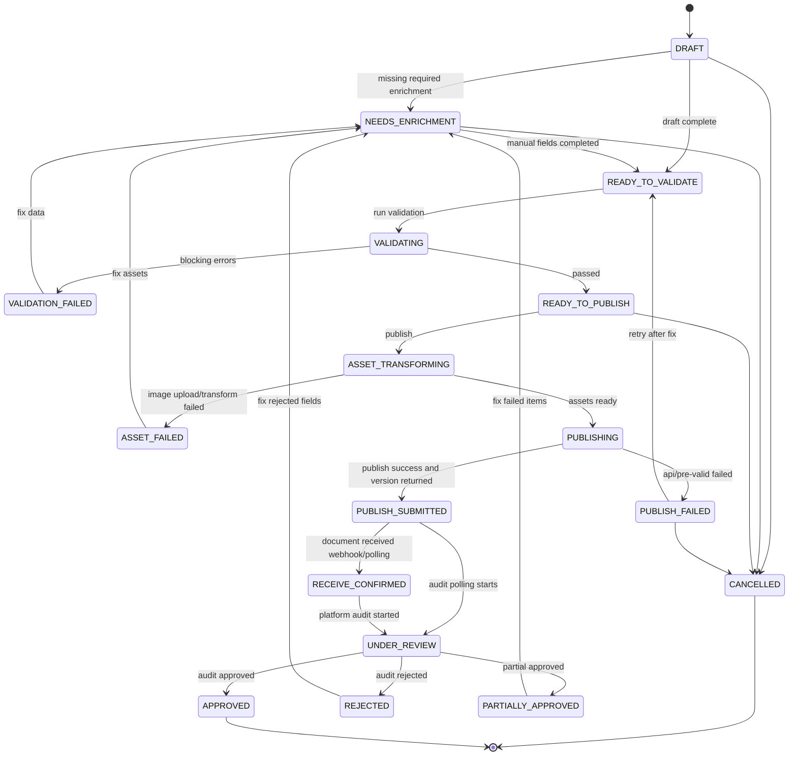

# SHEIN 全托管上新中台 MVP 技术规格

## 1. 范围

本文档定义第一版 MVP 的技术方案：

- 商品主数据模型。
- 内容与图片资产模型。
- 价格规则模型。
- 平台刊登模型。
- SHEIN 全托管发布适配器。
- SHEIN 发布状态机。
- 未来 TEMU 适配预留点。

MVP 只实现 SHEIN 全托管上新，不实现 TEMU 发布、订单履约、库存和财务。

## 2. 架构原则

### 2.1 核心原则

1. 核心商品模型不绑定 SHEIN 字段。
2. 平台特有字段进入 `channel_*` 或 `listing_*` 表。
3. 平台返回 ID 统一进入 `platform_identity`。
4. 所有发布动作异步任务化。
5. 发布请求和响应必须留档。
6. 发布时固化快照，后续源数据变化不反向影响历史发布任务。

### 2.2 模块分层

```text
Source Layer
  MDM SPU/SKU API
  DeepDraw API
  Guanyuan BI Excel
  Rule Excel
  Manual Image Package

Domain Layer
  Product Master
  Content Package
  Asset Library
  Price Policy

Listing Layer
  Listing Draft
  Validation
  Publish Snapshot
  Publish Version
  Platform Identity

Adapter Layer
  SHEIN Adapter
  TEMU Adapter (reserved)

Job Layer
  Sync Jobs
  Asset Transform Jobs
  Publish Jobs
  Status Sync Jobs
```

## 3. 数据表设计

字段类型以 PostgreSQL 为参考。正式实施时可按实际数据库调整。

### 3.1 同步批次

```sql
create table sync_batch (
  id bigserial primary key,
  source_system varchar(32) not null,
  source_object varchar(64) not null,
  batch_no varchar(64) not null,
  status varchar(32) not null,
  started_at timestamptz not null,
  finished_at timestamptz,
  total_count int default 0,
  success_count int default 0,
  failed_count int default 0,
  error_message text,
  created_at timestamptz not null default now()
);
```

### 3.2 商品主数据

```sql
create table product_spu (
  id bigserial primary key,
  spu_code varchar(64) not null unique,
  spu_name varchar(255),
  brand_code varchar(64),
  brand_name varchar(128),
  product_line_code varchar(64),
  product_line_name varchar(128),
  gender_code varchar(64),
  gender_name varchar(128),
  year int,
  season_code varchar(64),
  season_name varchar(128),
  category_l1_code varchar(64),
  category_l1_name varchar(128),
  category_l2_code varchar(64),
  category_l2_name varchar(128),
  category_l3_code varchar(64),
  category_l3_name varchar(128),
  fabric_name varchar(128),
  material text,
  lining text,
  composition text,
  raw_payload jsonb,
  source_hash varchar(64),
  synced_at timestamptz,
  created_at timestamptz not null default now(),
  updated_at timestamptz not null default now()
);
```

```sql
create table product_skc (
  id bigserial primary key,
  spu_id bigint not null references product_spu(id),
  skc_code varchar(64) not null unique,
  skc_name varchar(255),
  color_code varchar(64),
  color_name varchar(128),
  primary_asset_id bigint,
  raw_payload jsonb,
  source_hash varchar(64),
  synced_at timestamptz,
  created_at timestamptz not null default now(),
  updated_at timestamptz not null default now()
);
```

```sql
create table product_sku (
  id bigserial primary key,
  skc_id bigint not null references product_skc(id),
  sku_code varchar(64) not null unique,
  supplier_sku varchar(128),
  enterprise_code varchar(128),
  barcode varchar(64),
  size_code varchar(64),
  size_name varchar(128),
  international_code varchar(64),
  list_price numeric(12, 2),
  currency varchar(16) default 'CNY',
  raw_payload jsonb,
  source_hash varchar(64),
  synced_at timestamptz,
  created_at timestamptz not null default now(),
  updated_at timestamptz not null default now()
);
```

说明：

- `spu_code` 对应 MDM 款号。
- `skc_code` 对应 MDM SKC 编码。
- `sku_code` 对应 MDM SKU 编码。
- `supplier_sku` 对应 MDM 真实 SKU 字段，用于 SHEIN 商家 SKU。
- `enterprise_code` 是企业内部码，不直接作为 SHEIN 商家 SKU。
- 深绘和 MDM 的 SPU、SKC、SKU 字段本质对齐，同步时允许做清洗和归一化。

### 3.3 深绘内容包

```sql
create table product_content_package (
  id bigserial primary key,
  source_system varchar(32) not null default 'DEEPDRAW',
  source_code varchar(128) not null,
  spu_code varchar(64),
  title_cn varchar(1000),
  title_en varchar(1000),
  brand_name varchar(128),
  category_name varchar(255),
  trade_path varchar(512),
  colors jsonb,
  fields jsonb,
  size_tables jsonb,
  detail_pages jsonb,
  sku_items jsonb,
  raw_payload jsonb not null,
  version varchar(64),
  synced_at timestamptz,
  created_at timestamptz not null default now(),
  updated_at timestamptz not null default now(),
  unique(source_system, source_code)
);
```

### 3.4 图片与素材

```sql
create table product_asset (
  id bigserial primary key,
  owner_type varchar(32) not null,
  owner_id bigint not null,
  asset_type varchar(32) not null,
  source_system varchar(32) not null,
  source_url text,
  local_file_key text,
  platform_url text,
  width int,
  height int,
  file_size int,
  mime_type varchar(64),
  sort_no int default 0,
  status varchar(32) not null default 'PENDING',
  uploaded_by varchar(128),
  raw_payload jsonb,
  created_at timestamptz not null default now(),
  updated_at timestamptz not null default now()
);
```

`asset_type` 枚举：

| 值 | 含义 |
| --- | --- |
| MAIN | 主图 |
| DETAIL | 细节图 |
| SQUARE | 方形图 |
| COLOR_BLOCK | 色块图 |
| DETAIL_PAGE | 详情图 |
| SIZE_CHART | 尺码表图 |
| VIDEO | 视频 |

第一期图片来源：

- `MANUAL_PACKAGE`：人工上传的 SKC 维度图片包，作为发品主来源。
- `DEEPDRAW`：深绘主图和详情页，作为补充来源。
- `MDM`：MDM 返回的 SKC 图片候选，作为补充来源。

### 3.5 尺码表

```sql
create table product_size_chart (
  id bigserial primary key,
  owner_type varchar(32) not null,
  owner_id bigint not null,
  source_system varchar(32) not null,
  chart_name varchar(255),
  size_axis varchar(64),
  columns jsonb not null,
  rows jsonb not null,
  raw_payload jsonb,
  created_at timestamptz not null default now(),
  updated_at timestamptz not null default now()
);
```

### 3.6 业务规则和 Excel 导入

Excel 导入统一记录批次，具体业务表保存归一化后的规则数据。

```sql
create table business_import_batch (
  id bigserial primary key,
  import_type varchar(64) not null,
  file_name varchar(255) not null,
  file_key text,
  status varchar(32) not null,
  total_count int default 0,
  success_count int default 0,
  failed_count int default 0,
  error_message text,
  uploaded_by varchar(128),
  created_at timestamptz not null default now(),
  finished_at timestamptz
);
```

```sql
create table product_weight_import (
  id bigserial primary key,
  import_batch_id bigint not null references business_import_batch(id),
  spu_code varchar(64),
  skc_code varchar(64),
  sku_code varchar(64),
  package_weight_g int not null,
  raw_payload jsonb,
  created_at timestamptz not null default now()
);
```

```sql
create table size_conversion_rule (
  id bigserial primary key,
  import_batch_id bigint references business_import_batch(id),
  platform varchar(32) not null default 'SHEIN',
  local_size_code varchar(64),
  local_size_name varchar(128),
  shein_size_value varchar(128) not null,
  match_context jsonb,
  status varchar(32) not null default 'ACTIVE',
  created_at timestamptz not null default now(),
  updated_at timestamptz not null default now()
);
```

```sql
create table package_rule (
  id bigserial primary key,
  import_batch_id bigint references business_import_batch(id),
  rule_name varchar(128) not null,
  priority int not null,
  match_value jsonb not null,
  package_length_cm numeric(10, 2) not null,
  package_width_cm numeric(10, 2) not null,
  package_height_cm numeric(10, 2) not null,
  package_type varchar(64),
  status varchar(32) not null default 'ACTIVE',
  created_at timestamptz not null default now(),
  updated_at timestamptz not null default now()
);
```

```sql
create table mdm_shein_category_mapping_rule (
  id bigserial primary key,
  import_batch_id bigint references business_import_batch(id),
  mdm_middle_category_code varchar(64),
  mdm_middle_category_name varchar(128) not null,
  mdm_small_category_code varchar(64),
  mdm_small_category_name varchar(128) not null,
  gender_code varchar(64),
  gender_name varchar(128),
  age_group_code varchar(64),
  age_group_name varchar(128),
  match_mode varchar(32) not null default 'EXACT',
  match_key varchar(512) not null,
  shein_category_id bigint not null,
  shein_product_type_id bigint not null,
  priority int not null default 100,
  status varchar(32) not null default 'ACTIVE',
  source varchar(32) not null default 'MANUAL',
  dimension_payload jsonb not null default '{}'::jsonb,
  created_at timestamptz not null default now(),
  updated_at timestamptz not null default now()
);
```

说明：

- `product_weight_import` 第一版承接观远 BI 毛重 Excel。
- `size_conversion_rule` 承接 SHEIN 尺码转换表。
- `package_rule` 承接包装尺寸和包装类型规则，界面支持增删改查和批量应用。
- `mdm_shein_category_mapping_rule` 承接 MDM 中类、小类、性别、年龄段到 SHEIN 末级类目的组合业务规则；SHEIN 目标必须同时保存 `category_id` 和 `product_type_id`。

### 3.7 价格规则

```sql
create table price_policy (
  id bigserial primary key,
  policy_name varchar(128) not null,
  platform varchar(32) not null,
  channel_account_id bigint,
  effective_from date not null,
  effective_to date,
  status varchar(32) not null default 'ACTIVE',
  exchange_rate numeric(12, 4) default 7.3000,
  retail_round_scale int default 2,
  created_by varchar(128),
  created_at timestamptz not null default now(),
  updated_at timestamptz not null default now()
);
```

```sql
create table price_discount_rule (
  id bigserial primary key,
  policy_id bigint not null references price_policy(id),
  priority int not null,
  rule_name varchar(128) not null,
  match_type varchar(32) not null,
  match_value jsonb not null,
  discount numeric(8, 4) not null,
  status varchar(32) not null default 'ACTIVE',
  created_at timestamptz not null default now(),
  updated_at timestamptz not null default now()
);
```

```sql
create table price_calculation_snapshot (
  id bigserial primary key,
  listing_id bigint not null,
  listing_sku_id bigint,
  product_sku_id bigint not null,
  policy_id bigint not null,
  list_price numeric(12, 2) not null,
  discount numeric(8, 4) not null,
  cost_price numeric(12, 2) not null,
  suggested_retail_price numeric(12, 2),
  currency varchar(16) not null,
  exchange_rate numeric(12, 4),
  confirmation_status varchar(32) not null default 'PENDING',
  confirmed_by varchar(128),
  confirmed_at timestamptz,
  rule_trace jsonb,
  created_at timestamptz not null default now()
);
```

### 3.8 平台账号与元数据

```sql
create table channel_account (
  id bigserial primary key,
  platform varchar(32) not null,
  account_name varchar(128) not null,
  business_mode varchar(32) not null,
  region varchar(32),
  gateway_base_url text,
  credential_ref text not null,
  status varchar(32) not null default 'ACTIVE',
  raw_config jsonb,
  created_at timestamptz not null default now(),
  updated_at timestamptz not null default now()
);
```

```sql
create table channel_category (
  id bigserial primary key,
  platform varchar(32) not null,
  channel_account_id bigint references channel_account(id),
  platform_category_id varchar(128) not null,
  parent_platform_category_id varchar(128),
  product_type_id varchar(128),
  category_name varchar(255),
  is_leaf boolean default false,
  raw_payload jsonb,
  synced_at timestamptz,
  unique(platform, channel_account_id, platform_category_id)
);
```

```sql
create table channel_attribute_template (
  id bigserial primary key,
  platform varchar(32) not null,
  channel_account_id bigint references channel_account(id),
  platform_category_id varchar(128) not null,
  product_type_id varchar(128),
  template_payload jsonb not null,
  required_fields jsonb,
  enum_values jsonb,
  input_constraints jsonb,
  picture_config jsonb,
  default_language varchar(32),
  currency varchar(16),
  synced_at timestamptz,
  created_at timestamptz not null default now(),
  updated_at timestamptz not null default now()
);
```

```sql
create table channel_attribute_mapping (
  id bigserial primary key,
  platform varchar(32) not null,
  channel_account_id bigint references channel_account(id),
  local_field_key varchar(128) not null,
  platform_attribute_id varchar(128) not null,
  platform_attribute_name varchar(255),
  value_mapping jsonb,
  transform_rule jsonb,
  status varchar(32) not null default 'ACTIVE',
  created_at timestamptz not null default now(),
  updated_at timestamptz not null default now()
);
```

### 3.9 刊登草稿

```sql
create table listing (
  id bigserial primary key,
  platform varchar(32) not null,
  channel_account_id bigint not null references channel_account(id),
  business_mode varchar(32) not null,
  product_spu_id bigint not null references product_spu(id),
  listing_batch_no varchar(64),
  publish_unit_no varchar(64) not null default 'default',
  split_group_key varchar(128),
  split_reason text,
  title varchar(1000),
  description text,
  platform_category_id varchar(128),
  product_type_id varchar(128),
  default_language varchar(32),
  currency varchar(16),
  status varchar(32) not null default 'DRAFT',
  validation_status varchar(32) not null default 'NOT_VALIDATED',
  source_snapshot jsonb,
  created_by varchar(128),
  created_at timestamptz not null default now(),
  updated_at timestamptz not null default now()
);
```

说明：

- 一个款号默认生成一个 `listing`。
- 同一 SKC 拆成两个 SHEIN 链接时，同一 `product_spu_id` 可以生成多个 `listing`，通过 `publish_unit_no` 和 `split_group_key` 区分。
- 同一 `listing` 内仍保持 `listing_skc` 唯一，避免同一个发布链接内重复挂同一 SKC。

```sql
create table listing_skc (
  id bigserial primary key,
  listing_id bigint not null references listing(id),
  product_skc_id bigint not null references product_skc(id),
  supplier_code varchar(128) not null,
  skc_title varchar(1000),
  color_attribute_payload jsonb,
  status varchar(32) not null default 'DRAFT',
  created_at timestamptz not null default now(),
  updated_at timestamptz not null default now(),
  unique(listing_id, product_skc_id)
);
```

```sql
create table listing_sku (
  id bigserial primary key,
  listing_skc_id bigint not null references listing_skc(id),
  product_sku_id bigint not null references product_sku(id),
  supplier_sku varchar(128) not null,
  supplier_barcode varchar(64),
  size_attribute_payload jsonb,
  package_length_cm numeric(10, 2),
  package_width_cm numeric(10, 2),
  package_height_cm numeric(10, 2),
  package_weight_g int,
  mall_state int default 1,
  cost_price numeric(12, 2),
  currency varchar(16),
  status varchar(32) not null default 'DRAFT',
  created_at timestamptz not null default now(),
  updated_at timestamptz not null default now(),
  unique(listing_skc_id, product_sku_id)
);
```

```sql
create table listing_asset (
  id bigserial primary key,
  listing_id bigint not null references listing(id),
  listing_skc_id bigint references listing_skc(id),
  listing_sku_id bigint references listing_sku(id),
  product_asset_id bigint references product_asset(id),
  platform_image_type int,
  image_sort int not null,
  platform_url text,
  transform_status varchar(32) not null default 'PENDING',
  transform_error text,
  raw_response jsonb,
  created_at timestamptz not null default now(),
  updated_at timestamptz not null default now()
);
```

### 3.10 校验、任务、版本和平台身份

```sql
create table listing_validation_result (
  id bigserial primary key,
  listing_id bigint not null references listing(id),
  severity varchar(16) not null,
  module varchar(64) not null,
  field_key varchar(128),
  owner_type varchar(32),
  owner_id bigint,
  message text not null,
  suggestion text,
  resolved boolean not null default false,
  created_at timestamptz not null default now()
);
```

```sql
create table listing_publish_version (
  id bigserial primary key,
  listing_id bigint not null references listing(id),
  version_no int not null,
  version_type varchar(32) not null,
  status varchar(32) not null default 'DRAFT',
  source_snapshot jsonb not null,
  price_snapshot jsonb,
  asset_snapshot jsonb,
  request_payload jsonb,
  response_payload jsonb,
  platform_version varchar(128),
  error_code varchar(128),
  error_message text,
  created_by varchar(128),
  created_at timestamptz not null default now(),
  submitted_at timestamptz,
  unique(listing_id, version_no)
);
```

```sql
create table listing_publish_task (
  id bigserial primary key,
  listing_id bigint not null references listing(id),
  publish_version_id bigint references listing_publish_version(id),
  platform varchar(32) not null,
  task_type varchar(32) not null,
  status varchar(32) not null,
  attempt_count int not null default 0,
  max_attempts int not null default 3,
  request_payload jsonb,
  response_payload jsonb,
  platform_trace_id varchar(128),
  platform_version varchar(128),
  error_code varchar(128),
  error_message text,
  next_retry_at timestamptz,
  started_at timestamptz,
  finished_at timestamptz,
  created_at timestamptz not null default now(),
  updated_at timestamptz not null default now()
);
```

```sql
create table platform_identity (
  id bigserial primary key,
  platform varchar(32) not null,
  channel_account_id bigint not null references channel_account(id),
  local_type varchar(32) not null,
  local_id bigint not null,
  platform_type varchar(32) not null,
  platform_id varchar(128) not null,
  platform_parent_id varchar(128),
  raw_payload jsonb,
  created_at timestamptz not null default now(),
  updated_at timestamptz not null default now(),
  unique(platform, channel_account_id, local_type, local_id, platform_type)
);
```

## 4. SHEIN 全托管适配器

### 4.1 外部接口

MVP 需要实现以下 SHEIN 接口调用：

| 能力 | 接口 |
| --- | --- |
| 获取密钥 | `/open-api/auth/get-by-token` |
| 发布字段规范 | `/open-api/goods/query-publish-fill-in-standard` |
| 类目树 | `/open-api/goods/query-category-tree` |
| 属性模板 | `/open-api/goods/query-attribute-template` |
| SKU 重复检查 | `/open-api/goods/product/check-supplierSku-repeated` |
| 图片上传 | `/open-api/goods/upload-pic` |
| 图片链接转换 | `/open-api/goods/transform-pic` |
| 商品发布 | `/open-api/goods/product/publishOrEdit` |
| 审核状态 | `/open-api/goods/query-document-state` |
| SPU 详情 | `/open-api/goods/spu-info` |

后续供货价更新预留：

| 能力 | 接口 |
| --- | --- |
| 更新供货价 | `/open-api/goods/update-cost` |

### 4.2 从零开始的元数据打通

第一阶段建议先打通 SHEIN 店铺元数据，不急于真实发品：

1. 在 `channel_account` 配置 SHEIN 测试账号、业务模式、网关地址和凭据引用。
2. 调用 `/open-api/auth/get-by-token` 验证授权链路或获取授权店铺密钥。
3. 调用 `/open-api/goods/query-category-tree` 获取当前店铺可发布类目树，写入 `channel_category`。
4. 对可发布叶子类目调用 `/open-api/goods/query-publish-fill-in-standard`，保存默认语种、币种、图片要求和发布字段规范。
5. 对可发布叶子类目调用 `/open-api/goods/query-attribute-template`，保存必填属性、枚举值和可填写范围。
6. 在界面维护 `MDM 中类 + 小类 + 性别 + 年龄段 -> SHEIN 末级类目` 映射，写入 `mdm_shein_category_mapping_rule`。
7. 用一个款号生成草稿并构造 payload，验证类目、属性、尺码、图片和价格字段能完整落到 SHEIN 结构。

接口探查结论：

- 测试环境网关使用 `https://openapi-test01.sheincorp.cn`；生产全托管/代运营通常使用 `https://openapi.sheincorp.cn`。
- `/open-api/auth/get-by-token` 属于应用验签接口，签名头使用 `x-lt-appid`，签名密钥使用应用 `APP_secretKey`。
- 普通业务接口属于店铺验签接口，签名头使用 `x-lt-openKeyId`，签名密钥使用店铺 `secretKey`。
- 授权测试工具生成的 `openKeyId/secretKey` 只用于模拟授权流程，不能直接作为真实测试店铺密钥调用业务接口。
- 测试阶段调用业务接口需要进入控制台的 `测试店铺` 获取该业务模式对应的测试店铺 `openKeyId/secretKey`。

关键接口入参：

| 接口 | 请求体 | 关键返回 |
| --- | --- | --- |
| `/open-api/goods/query-category-tree` | 空 body | `category_id`、`product_type_id`、`parent_category_id`、`last_category`、`children` |
| `/open-api/goods/query-publish-fill-in-standard` | 可空；查类目/图片要求时传 `{ "category_id": 末级类目ID }` | `fill_in_standard_list`、`default_language`、`currency`、`picture_config_list`、`support_sale_attribute_sort` |
| `/open-api/goods/query-attribute-template` | `{ "product_type_id_list": [末级类目的 product_type_id] }`，单次最多 10 个 | `attribute_infos`、`attribute_type`、`attribute_status`、`attribute_mode`、`attribute_value_info_list` |

实现注意：

- `last_category=true` 的类目才可用于商品发布。
- `category_id` 用于发布商品归属类目；`product_type_id` 用于查询属性模板和构造属性相关字段。
- `attribute_status=3` 表示必填；`attribute_type=1` 是销售属性，`2` 是尺寸属性，`3/4` 进入普通商品属性。
- `attribute_mode` 决定填写方式：手输值、单选、多选或手输加枚举。
- `fill_in_standard_list.show=false` 的字段不要提交，提交反而可能报错。
- 需定期或每次发布前刷新类目、发布规范和属性模板，因为 SHEIN 会调整店铺可发类目和必填属性。

本地调试脚本：

```bash
SHEIN_OPEN_KEY_ID=... SHEIN_SECRET_KEY=... node scripts/shein_probe.mjs category-tree
SHEIN_OPEN_KEY_ID=... SHEIN_SECRET_KEY=... node scripts/shein_probe.mjs publish-standard <category_id>
SHEIN_OPEN_KEY_ID=... SHEIN_SECRET_KEY=... node scripts/shein_probe.mjs attribute-template <product_type_id>
```

### 4.3 发布前准备

对每个 listing：

1. 根据 `channel_account` 获取 SHEIN 凭据。
2. 根据平台类目查询发布规范。
3. 将发布规范保存到 `channel_attribute_template`。
4. 查询属性模板。
5. 判断图片方案，确定是否传 `is_spu_pic=true`。
6. 检查供应商 SKU 是否重复。
7. 检查草稿是否满足全托管发布字段。

### 4.4 图片转换

SHEIN 发布接口只接受 SHEIN 可用 URL。

转换规则：

- 如果是人工上传图片包，按 SKC 绑定到 `product_asset` 和 `listing_asset` 后调用 `upload-pic`。
- 如果是深绘外部 URL，调用 `transform-pic`。
- 转换成功后写入 `listing_asset.platform_url`。
- 转换失败写入 `listing_validation_result` 阻断发布。

SHEIN 图片类型映射：

| 内部类型 | SHEIN image_type |
| --- | --- |
| MAIN | 1 |
| DETAIL | 2 |
| SQUARE | 5 |
| COLOR_BLOCK | 6 |
| DETAIL_PAGE | 7 |

### 4.5 发布 payload 构建

核心字段来源：

| SHEIN 字段 | 来源 |
| --- | --- |
| `category_id` | `listing.platform_category_id` |
| `product_type_id` | `listing.product_type_id` |
| `multi_language_name_list` | 深绘标题或人工标题 |
| `multi_language_desc_list` | 深绘详情或人工描述 |
| `product_attribute_list` | 属性映射结果 |
| `size_attribute_list` | 深绘尺码表 + SHEIN 属性模板 |
| `skc_list.supplier_code` | MDM `SKC编码` |
| `skc_list.sale_attribute` | 颜色属性映射 |
| `skc_list.image_info` | `listing_asset` |
| `sku_list.supplier_sku` | MDM 真实 SKU 字段 |
| `sku_list.supplier_barcode` | MDM 条码 |
| `sku_list.cost_info.cost_price` | `price_calculation_snapshot.cost_price` |
| `sku_list.cost_info.currency` | 发布规范返回 currency |
| `sku_list.length/width/height/weight` | 包装规则、观远 BI 毛重或人工补齐 |
| `sku_list.mall_state` | 默认 1 |

### 4.6 发布结果处理

发布成功响应中需要保存：

- `info.spu_name` -> `platform_identity`
- `info.skc_list[].skc_name` -> `platform_identity`
- `info.skc_list[].sku_list[].sku_code` -> `platform_identity`
- `info.version` -> `listing_publish_task.platform_version`
- `info.version` -> `listing_publish_version.platform_version`

发布接口返回 `pre_valid_result` 或 `mcc_valid_result` 时：

- `type=2` 视为阻断。
- 写入 `listing_validation_result`。
- listing 状态进入 `PUBLISH_FAILED` 或 `BLOCKED`。

每次发布或编辑前必须创建新的 `listing_publish_version`。失败后不覆盖原版本，修正草稿后生成新版本重新提交。

## 5. SHEIN 发布状态机

### 5.1 状态定义

| 状态 | 含义 |
| --- | --- |
| `DRAFT` | 草稿已创建，未补齐 |
| `NEEDS_ENRICHMENT` | 需要人工补图、补属性、补包装或补价格 |
| `READY_TO_VALIDATE` | 必要信息已齐，等待校验 |
| `VALIDATING` | 执行发布前校验 |
| `VALIDATION_FAILED` | 校验失败，存在阻断项 |
| `READY_TO_PUBLISH` | 校验通过，允许发布 |
| `ASSET_TRANSFORMING` | 图片上传或转换中 |
| `ASSET_FAILED` | 图片转换失败 |
| `PUBLISHING` | 调用 SHEIN 发布接口中 |
| `PUBLISH_SUBMITTED` | 发布请求已提交并返回版本号 |
| `RECEIVE_CONFIRMED` | SHEIN 公文接收成功 |
| `UNDER_REVIEW` | SHEIN 审核中 |
| `APPROVED` | 审核通过 |
| `REJECTED` | 审核驳回 |
| `PARTIALLY_APPROVED` | 部分 SKU 或 SKC 通过 |
| `PUBLISH_FAILED` | 发布接口失败或平台预校验失败 |
| `CANCELLED` | 用户取消发布 |

### 5.2 Mermaid 状态图



### 5.3 状态迁移规则

| 当前状态 | 事件 | 下一个状态 |
| --- | --- | --- |
| `DRAFT` | 缺字段 | `NEEDS_ENRICHMENT` |
| `DRAFT` | 字段齐全 | `READY_TO_VALIDATE` |
| `NEEDS_ENRICHMENT` | 人工补齐 | `READY_TO_VALIDATE` |
| `READY_TO_VALIDATE` | 开始校验 | `VALIDATING` |
| `VALIDATING` | 有阻断项 | `VALIDATION_FAILED` |
| `VALIDATING` | 通过 | `READY_TO_PUBLISH` |
| `READY_TO_PUBLISH` | 点击发布 | `ASSET_TRANSFORMING` |
| `ASSET_TRANSFORMING` | 图片失败 | `ASSET_FAILED` |
| `ASSET_TRANSFORMING` | 图片完成 | `PUBLISHING` |
| `PUBLISHING` | 接口失败 | `PUBLISH_FAILED` |
| `PUBLISHING` | 接口成功 | `PUBLISH_SUBMITTED` |
| `PUBLISH_SUBMITTED` | 公文接收成功 | `RECEIVE_CONFIRMED` |
| `RECEIVE_CONFIRMED` | 开始审核 | `UNDER_REVIEW` |
| `UNDER_REVIEW` | 审核通过 | `APPROVED` |
| `UNDER_REVIEW` | 审核驳回 | `REJECTED` |
| `UNDER_REVIEW` | 部分通过 | `PARTIALLY_APPROVED` |

### 5.4 重试策略

| 场景 | 策略 |
| --- | --- |
| 网络超时 | 自动重试，最多 3 次 |
| SHEIN 5xx | 自动重试，指数退避 |
| 图片尺寸不合规 | 不自动重试，转人工 |
| 字段缺失 | 不自动重试，转人工 |
| SKU 重复 | 不自动重试，转人工 |
| 审核驳回 | 不自动重试，修正后重新提交 |

## 6. 发布前校验规则

### 6.1 商品层

阻断：

- `listing.platform_category_id` 为空。
- 缺少默认语种标题。
- 缺少必填商品属性。
- 必填商品属性未命中 SHEIN 枚举值或可填写范围。
- 类目属性模板未同步。

### 6.2 SKC 层

阻断：

- `listing_skc.supplier_code` 为空。
- 缺少主销售属性颜色映射。
- 缺少 SHEIN 必填图片。
- 多 SKC 场景缺少色块图且类目要求必填。

### 6.3 SKU 层

阻断：

- `listing_sku.supplier_sku` 为空。
- `supplier_sku` 在 SHEIN 店铺内重复。
- 缺少尺码销售属性映射。
- 缺少供货价。
- 价格快照未人工确认。
- 缺少包装长宽高和毛重。

### 6.4 价格层

阻断：

- 未绑定价格政策。
- 折扣计算结果为空。
- 供货价小于等于 0。
- 币种为空。
- 价格字段未人工确认。

警告：

- 使用默认折扣规则。
- 使用默认汇率。
- 命中低倍率规则。

## 7. 内部服务接口建议

MVP 后端可以先按以下服务边界实现：

| 服务 | 职责 |
| --- | --- |
| `ProductSyncService` | 同步 MDM SPU/SKU |
| `DeepDrawSyncService` | 同步深绘内容包 |
| `RuleImportService` | 导入观远 BI 毛重、尺码转换表、包装规则、类目映射和低倍率清单 |
| `SheinMetadataService` | 同步 SHEIN 可发布类目、发布字段规范、属性模板、枚举值和可填写范围 |
| `ListingDraftService` | 生成刊登草稿 |
| `AssetService` | 图片上传、绑定、转换状态管理 |
| `PriceService` | 折扣规则、试算、快照 |
| `ListingValidationService` | 发布前校验 |
| `SheinAdapter` | SHEIN API 签名、请求、响应转换 |
| `PublishWorkflowService` | 状态机和任务编排 |

内部 API 示例：

```text
POST /api/rule-imports
GET  /api/channel-categories
POST /api/channel-categories/sync
POST /api/channel-category-mappings/import
POST /api/listing-batches
POST /api/listings/{id}/validate
POST /api/listings/{id}/publish
GET  /api/listings/{id}/publish-versions
GET  /api/listings/{id}/publish-tasks
POST /api/listing-skc/{id}/assets
POST /api/price-policies/{id}/simulate
```

## 8. 任务设计

### 8.1 任务类型

| 任务类型 | 说明 |
| --- | --- |
| `SYNC_MDM_SPU` | 同步 MDM SPU |
| `SYNC_MDM_SKU` | 同步 MDM SKU |
| `SYNC_DEEPDRAW` | 同步深绘 |
| `IMPORT_RULE_EXCEL` | 导入 Excel 业务规则 |
| `SYNC_SHEIN_CATEGORY` | 同步 SHEIN 可发布类目 |
| `SYNC_SHEIN_ATTRIBUTE_TEMPLATE` | 同步 SHEIN 发布字段规范和属性模板 |
| `TRANSFORM_ASSET` | 上传或转换 SHEIN 图片 |
| `PUBLISH_LISTING` | 发布商品 |
| `SYNC_AUDIT_STATUS` | 查询审核状态 |

### 8.2 幂等键

| 任务 | 幂等键 |
| --- | --- |
| MDM SPU 同步 | `source_system + spu_code + source_hash` |
| MDM SKU 同步 | `source_system + sku_code + source_hash` |
| 深绘同步 | `source_system + source_code + version` |
| Excel 规则导入 | `import_type + file_hash` |
| SHEIN 类目同步 | `platform + channel_account_id + platform_category_id` |
| SHEIN 属性模板同步 | `platform + channel_account_id + platform_category_id + product_type_id + template_hash` |
| 图片转换 | `listing_asset_id + source_url + image_type` |
| 商品发布 | `listing_id + publish_version_id` |

## 9. TEMU 预留设计

TEMU 接入时新增 `TemuAdapter`，但不修改核心表。

### 9.1 平台身份映射

| 本地对象 | SHEIN | TEMU |
| --- | --- | --- |
| SPU | `spu_name` | `productId` |
| SKC | `skc_name` | `productSkcId` |
| SKU | `sku_code` | `productSkuId` |

### 9.2 元数据映射

TEMU 需要在 `channel_category` 和 `channel_attribute_template` 中保存：

- `cat1Id` 到 `cat9Id`。
- 叶子类目 ID。
- `pid`、`templatePid`。
- `specId`、`parentSpecId`。
- 尺码表 `businessId` 或 `tempBusinessId`。

### 9.3 适配器差异

`PlatformAdapter` 接口需要预留：

```text
fetchCategoryTree(account)
fetchAttributeTemplate(account, category)
uploadAsset(account, asset)
prepareSizeChart(account, listing)
buildPublishPayload(listing)
publishListing(account, payload)
syncPublishStatus(account, platformIdentity)
syncPriceWorkflow(account, listing)
```

SHEIN 第一版可以将 `prepareSizeChart` 合并到 `buildPublishPayload`；TEMU 后续必须单独实现尺码表创建流程。

## 10. 实施分期

### Phase 0: SHEIN 元数据打通

- 配置 SHEIN 测试账号。
- 调用鉴权接口。
- 同步当前店铺可发布类目树。
- 同步叶子类目的发布字段规范、属性模板、枚举值和可填写范围。
- 维护 MDM 中类、小类、性别、年龄段到 SHEIN 末级类目的组合映射规则。
- 用样例款号构造发布 payload，不要求真实发布。

### Phase 1: 数据底座

- 建表。
- MDM 同步。
- 深绘同步。
- 商品 SPU/SKC/SKU 聚合。
- 观远 BI 毛重 Excel 导入。
- 尺码转换、包装规则、低倍率清单和类目映射规则导入。

### Phase 2: 草稿和补齐

- 批次创建。
- SHEIN 草稿生成。
- 同一 SKC 拆多个发布链接的草稿拆分能力。
- SKC 图片人工上传。
- 包装尺寸和毛重维护。

### Phase 3: 价格和校验

- 折扣规则。
- 价格试算。
- 价格快照。
- 价格人工确认。
- 发布前校验。

### Phase 4: SHEIN 发布

- SHEIN 账号和签名。
- 发布规范和属性模板同步。
- 图片转换。
- `publishOrEdit` 发布。
- 发布版本和请求响应快照。
- 状态轮询和结果回写。

### Phase 5: 多平台准备

- 抽象 `PlatformAdapter`。
- 增加 TEMU 元数据表字段验证。
- 不实际发布 TEMU。

## 11. 风险与处理

| 风险 | 处理 |
| --- | --- |
| SHEIN 类目规则变化 | 每次发布前查询发布规范和属性模板 |
| 图片不符合平台要求 | 转换前做尺寸检查，失败转人工 |
| 深绘与 MDM 关联不稳定 | 支持人工绑定内容包和款号 |
| 价格规则误用 | 发布前生成快照并需要确认 |
| SHEIN Webhook 未开通 | MVP 使用轮询审核状态 |
| 后续 TEMU 差异过大 | 通过平台适配器隔离，不污染核心商品表 |

## 12. 开放问题

1. 手动上传图片包的目录结构、命名规则、图片用途识别方式和 SKC 匹配规则。
2. 同一 SKC 拆成多个 SHEIN 链接发布时的业务触发条件、拆分维度和界面操作方式。
3. SHEIN 全托管发布时 `cost_info.currency`、默认语种和类目权限是否固定。
4. SHEIN Webhook 是否能在测试环境开通；若不能，MVP 使用轮询。
5. SHEIN 接口签名、token 刷新、限流和错误码处理细节，以 SHEIN 开放平台实际文档和测试账号返回为准。
